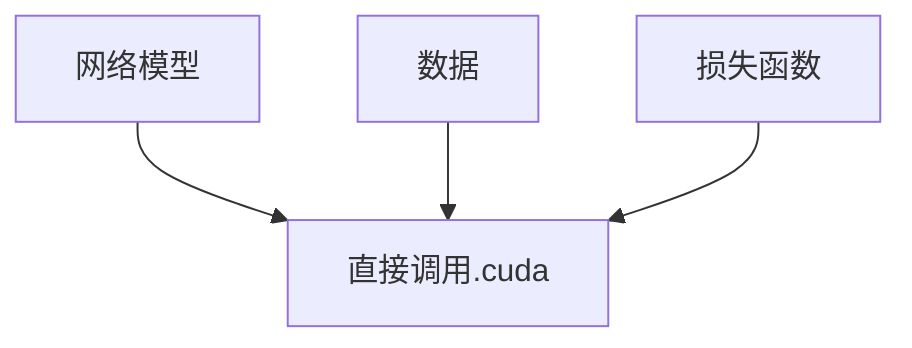
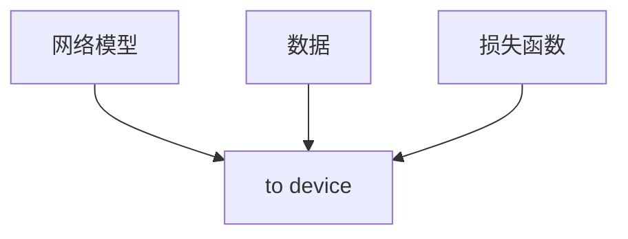

# 1.Dive Into Deep Learning

https://zh-v2.d2l.ai/

## 1.1安装过程

使用conda/minicondahuanjing

```
conda env remove d2l-zh
conda create -n  d2l-zh python=3.8 pip
conda activate d2l-zh

//安装需要的包
pip install  jupyter d2l torch torchvision

//下载代码并执行
wget https://zh-v2.d2l/ai/d2l-zh.zip
//wget 可能需要提前安装brew包
```

## 1.2矩阵计算

矩阵计算是为了计算矩阵的导数，梯度指向变化最大的方向。

标量对向量的导数($\frac{\partial y}{\partial x}$),y(1,)为标量，x(n,1)or(n,k)为向量或矩阵会使得结果为行向量$\frac{\partial y}{\partial x}$(1,n)和矩阵$\frac{\partial y}{\partial x}$(k,n)

若y为向量(m,1),x为向量或矩阵则没有发生变化，正常求导


|      |        | 标量                                 | 向量                                   | 矩阵                                     |
| ---- | ------ | ------------------------------------ | -------------------------------------- | ---------------------------------------- |
|      |        | x(1,)                                | x(n.,1)                                | x(n,k)                                   |
| 标量 | y(1,)  | $\frac{\partial y}{\partial x}$(1,)  | $\frac{\partial y}{\partial x}$(1,n)   | $\frac{\partial y}{\partial x}$(k,n)     |
| 向量 | y(m,1) | $\frac{\partial y}{\partial x}$(m,1) | $\frac{\partial y}{\partial x}$(m,n)   | $\frac{\partial y}{\partial x}$(m,k,n)   |
| 矩阵 | y(m,l) | $\frac{\partial y}{\partial x}$(m,l) | $\frac{\partial y}{\partial x}$(m,l,n) | $\frac{\partial y}{\partial x}$(m,l,k,n) |

## 1.3自动求导

在标量中求导有链式法则

即$$ y = f(u),u=g(x) \\ \frac{\partial y}{\partial x}=\frac{\partial y}{\partial u}\frac{\partial u}{\partial x} $$

当链式法则拓展到向量时

| $\frac{\partial y}{\partial x}=\frac{\partial y}{\partial u}\frac{\partial u}{\partial x}$ | $\frac{\partial y}{\partial x}=\frac{\partial y}{\partial u}\frac{\partial u}{\partial x}$ | $\frac{\partial y}{\partial x}=\frac{\partial y}{\partial u}\frac{\partial u}{\partial x}$ |
| ------------------------------------------------------------ | ------------------------------------------------------------ | ------------------------------------------------------------ |
| (1,n)  (1,)(1,n)                                             | (1,n)= (1,k)(k,n)                                            | (m,n)=(m,k)(k,n)                                             |

自动求导指计算一个函数在指定值上的导数

## 1.4计算图

- 将代码分解成操作子


- 将计算表示成一个无环图，也即链式求导的过程


# 2.线性回归+基础优化算法

## 2.1线性回归

线性回归用来进行预测分析，是对n维输入的加权，外加偏差

可以看做是单层的神经网络

## 2.2基础优化算法

### 2.2.1梯度下降：挑选一个初始值w0.重复迭代参数t。

- 沿梯度方向将增加损失函数值

- 学习率：步长的超参数（超参数：在开始学习过程之前就设置值的参数，而不是通过训练的到的参数数据。通常需要对超参数进行优化）

- 选择学习率，不能太小（需要计算梯度，梯度会一直保存占用内存）也不能太大（使得下降过程一直在震荡，并没有明显下降）

### 2.2.2小批量随机梯度下降

随机采样b个样本，来近似损失

$$\frac{1}{b}\sum_{i \in I_b}\varphi(X_i,y_i,W) $$

b是批量大小，也是另一个重要的超参数，同样的不能太小，计算量太小时，不适合并行来最大利用计算资源，不能太大，内存消耗增加，浪费计算

## 2.3总结

- 梯度下降通过不断沿着反梯度方向更新参数求解

- 小批量随机梯度下降时深度学习默认的求解算法

- 两重要的超参数是批量大小和学习率

- 具体实现见代码页：线性回归从零实现。

- 其中根据带有噪声的线性模型构造了一个人造数据集，在这段代码中生成了一个包含1000个样本的数据集，每个样本包含从标准正态分布中采样的两个特征，使用线性模型参数w =$[2, -3.4]^T$、b=4.2和噪声项$\epsilon$ 生成数据集及其标签

  y =Xw + b+ $\epsilon$

  可以将epsilon看作模型预测和标签时的潜在观测误差。这里假设成立，epsilon服从均值为0的正态分布。

  通过小批量运算能直观的感受到：读取一个小批量数据样本并打印，每个批量的特征维度显示批量大小和输入特征数，同样的批量的标签形状与batch_size相等。

  

  
  
  ## 2.4 softmax回归 +损失函数 
  
  - 回归估计一个连续值
  - 分类预测一个离散类别
  
  回归

  - 单连续数值输出
  - 自然区间
  - 跟真实值的区别作为损失

  分类

  - 通常多个输出

  - 输出i时预测为第i类的置信度

    

    ### 2.4.1softmax回归
  
    
  
    - softmax回归是一个多类分类模型，即一个多个输出的模型，每个类别对应一个输出
    - 使用softmax操作子的到每个类的预测之心度
    - 使用交叉熵来衡量预测和标号的区别

### 2.4.2损失函数

#### 均方损失 L2 Loss

$$l(y,y') = \frac{1}{2}\sum(y-y')^2$$


# 3.模型选择+过拟合和欠拟合

## 3.1训练误差和泛化误差

- 训练误差：模型在训练数据上的误差
- 泛化误差：**模型在新数据上的误差**
- 例子：根据模考成绩来预测未来考试分数
  - 在过去的考试中表现很好（训练误差）不代表未来考试一定会好（泛化误差）
  - 学生A通过背书在模考中拿到好成绩
  - 学生B知道答案后面的原因 

## 3.2验证数据集和测试数据集

- 验证数据集：一个用来评估模型好坏的数据集
  - 例如拿出50%的训练数据
  - 不要跟训练数据混在一起（常犯错误）
- 测试数据集：只用一次的数据集

## 3.3 k-折交叉验证

- 在没有足够多数据时使用（常态）
- 算法：
  - 将训练数据分割成k块
  - For i=1,...,k
    - 使用第i块作为验证数据集，其余的作为训练数据集
  - 报告k个验证集误差的平均
- 常用：k=5 or 10

## 3.4 总结

- 训练数据集：训练模型参数
- 验证数据集：选择模型超参数
- 非大数据集上通常使用k-则交叉验证

## 3.5过拟合和欠拟合

### 模型容量

- 拟合各种函数的能力
- 低容量的模型难以拟合训练数据（欠拟合）
- 高容量的模型可以记住所有的训练数据（过拟合）
- 上述两种情况都是不好的

## VC维

- 统计学习理论的一个核心思想
- 对于一个分类模型，VC等于一个最大的数据集的大小，不管如何给定标号，都存在一个模型来对它进行完美分类


# 4.PyTorch神经网络基础

## 4.1 模型构造

PyTorch中Module类，在PyTorch中任何一个层或者神经网络都可以看作是Module的子类,下段代码中自定义了一个MLP继承了nn.Module子类，其中包含两个函数__init__和 forward，

```python
import torch
from torch import nn
from torch.nn import functional as F
net = nn.Sequential(nn.Linear(20, 256), nn.Relu(), nn.Linear(256, 10))
X = torch.rand(2, 20)
net(X)

class MLP(nn.module):
  # init包含了所有的层
  def __init__(self):
    super().__init__()#调用父类的初始化函数
    self.hidden = nn.Linear(20, 256) #self类的成员变量
    self.out = nn.Linear(256, 10)
  # 输出  
  def forward(self, x):
    return self.out(F.relu(self.hidden(x)))

  #使用,与前六行代码同一作用
net = MLP()
net(X)
```

```python
class MySequential(nn.Module):
  def __init__(self, *args):
    super().__init__()
    for block in args:
      self._modules[block] = block #自己作为key存入
    
  def forward(self, X):
    for block in self._modules.values():
      X = block(X)
    return X

net = MySequential(nn.Linear(20, 256), nn.ReLU(), nn.Linear(256, 10))
net(X)
```

通过继承nn.Module的方法可以比Sequential更灵活的定义参数和怎样去做参数计算

并且可以混合搭配各种组合块的方法

```python
class NestMLP(nn.Module):
  def __init__():
    super().__init__()
    # 嵌套了一个Sequetial和一个单独的线性层
    self.net = nn.Sequential(nn.Linear(20, 64), nn.ReLU(),
                             nn.Linear(64, 32), nn.ReLU())
    self.linear = nn.Linear(32, 16)
    
  def forward(self, X):
    return self.linear(self.net(X))
  
chimera = nn.Sequential(NestMLP(), nn.Linear(16, 20), FixedHiddenMLP())
chimera(X)
```

自定义模块 就是定义好init中有哪些层 和 forward前向计算需要怎么计算


## 4.2 参数管理

```python
import torch
from torch import nn

net = nn.Sequential(nn.Linear(4, 8), nn.ReLU(), nn.Linear(8, 1))
X = torch.rand(size=(2, 4))
net(X)

print(net[2].stat_dict())
```

net是一个nn.Sequential,Sequential可以看成一个字典，net[2]位置相当于nn.Linear(8, 1)层，stat_dict表示状态字典

还可以通过print网络了解到网络的模样

## 4.3 内置参数初始化

​	

```python
def init_normal(m):
  if type(m) == nn.Linear:
    nn.init.normal_(m.weight, mean=0, std=0.01)
    nn.init.zeros_(m.bias)

net.apply(init_normal)
net[0].weight.data[0], net[0].bias.data[0]
# Out: (tensor([-0.0027, -0.009, -0.0076, 0.01061]), tensor(0.))
def init_constant(m):
  if type(m) == nn.Linear:
    nn.init.constant_(m.weight, 1)
    nn.init_zeros_(m.bias)
    
nn.apply(init_constant)
net[0].weight.data[0], net[0].bias.data[0]
# Out: (tensor([1., 1., 1., 1.]), tensor(0.))
```

## 4.4 自定义层

自定义一个层和自定义一个网络没有区别，层也是nn.Module的子类

```python
class MyLinear(nn.Module):
  def __init__(slef, in_units, units):
    super().__init()
    # 利用0-1正态分布随机生成数添加到权重参数中
    self.weight == nn.Parameter(torch.randn(in_units, units))
    # 同样的使用正态分布随机生成偏置参数
    self.bias == nn.Parameter(torch.randn(units, ))
  
  def forward(self, X):
    # weight.data和矩阵做一次乘法再加上偏置
    linear = torch.matmul(X, slef.weight.data) + self.bias.data
    return F.relu(linear)

dense = MyLinear(5, 3)
dense.weight
```

## 4.5 读写文件

### 4.5.1 加载和保存张量

```python
import torch
from torch import nn
from torch.nn import functional as F

x = torch.arrange(4)
torch.save(x, 'x-file')
x2 = torch.load('x-file')
x2
#Out: tensor([0, 1, 2, 3])
```

### 4.5.2 存储一个张量列表，然后把它们读回内存

```python
y = torch.zeros(4)
torch.save([x, y], 'x-file')
x2, y2 = torch.load('x-file')
(x2, y2)
# Out: (tensor([0, 1, 2, 3]), tensor([0., 0., 0., 0.]))
```

### 4.5.3 写入或读取从字符串映射到张量的字典

```python
mydict = {'x':x, 'y':y}
torch.save(mydict, 'mydict')
mydict2 = torch.load('mydict')
mydict2
# Out: {'x':tensor([0, 1, 2, 3]), 'y':tensor([0., 0., 0., 0.])}
```

### 4.5.4 加载和保存模型参数

```python
class MLP(nn.module):
  # init包含了所有的层
  def __init__(self):
    super().__init__()#调用父类的初始化函数
    self.hidden = nn.Linear(20, 256) #self类的成员变量
    self.output = nn.Linear(256, 10)
  # 输出  
  def forward(self, x):
    return self.output(F.relu(self.hidden(x)))
net = MLP()
X = torch.randn(size=(2, 20))
Y = net(X)

#存储
torch.save(net.stat_dict(), 'mlp.params')

#load 回来
# 要先声明一个MLP
clone = MLP()
# 将磁盘上的参数load进网络
clone.load_stat_dict(torch.load('mlp.params'))
clone.eval()
```


# 5.神经网络知识

分类器的两个原则，1、平移不变性，2、局部性

## 5.1 卷积是如何从全连接层出发变成卷积层

- 将输入和输出变形位矩阵（宽度，高度）

- 将权重变形位4-D张量（h，w）到（h',w'）

  $$ h_{i,j} = \sum_{k,l}W_{i,j,k,l}X_{k,l} = \sum_{a,b}V_{i,j,a,b}X_{i+a,j+b}$$

- V是W的重新索引$V_{i,j,a,b} = W_{i,j,i+a,j+b}$

### 5.1.1 原则1 - 平移不变性

- x的平移导致h的平移$ h_{i,j} =  \sum_{a,b}V_{i,j,a,b}X_{i+a,j+b}$

- v不应该依赖于（i，j）

- 解决方案：使$v_{i,j,a,b} = v_{a,b}$

  $h_{i,j} =\sum_{a,b}v_{a,b}X_{i+a,j+b}$

  这是2维的交叉相关也可以被称为2维卷积

### 5.1.2 原则2 -局部性

$h_{i,j} =\sum_{a,b}v_{a,b}X_{i+a,j+b}$

- 当评估$h_{i,j}$时，我们不应该用远离$x_{i,j}$的参数
- 解决方案：当$\lvert a \rvert,\lvert b \rvert>\delta时，使得V_{a,b} = 0$

$$h_{i,j}=\sum^{\delta}_{a=-\delta}\sum^{\delta}_{b=-\delta}V_{a,b}X_{i+a,j+b}$$

简单来说就是只看附近的点不去管远处的点

### 5.1.3 总结

- 对全连接层使用平移不变性和局部性得到卷积层


## 5.2 卷积层

- 卷积层将输入和核矩阵进行交叉相关，加上偏移后的到输出
- 核矩阵和偏移时可学习的参数
- 核矩阵的大小是超参数
- 我的理解，卷积层是一个特征提取层，通过卷积操作将图像的特征过滤提取出来进行下一步的处理，并且卷积的操作提供了参数共享和稀疏链接两种特性，使得参数的量大幅减少，并且只对区域内的一个部分敏感。
- [相关代码](http://localhost:8888/notebooks/pytorch/chapter_convolutional-neural-networks/conv-layer.ipynb)(要打开jupyter)
- [卷积动画](https://github.com/vdumoulin/conv_arithmetic/blob/master/README.md)

### 5.2.1 卷积层的填充和步幅

#### 填充padding

在输入的周围添加额外的行/列，通过填充可以使得图像不至于越来越小

$n \times n$的图像 卷积核为$f \times f$，则得到的图像为
$$
(n-f+1)\times(n-f+1)
$$


通过填充让图像不至于越来越小，于是输出变成了(n+2p-f+1)**
$$
(n+2p-f+1)\times(n+2p-f+1)
$$


 选择合适的填充像素有两种方式

1.Valid卷积

也即不填充，no padding

得到的图像大小为
$$
(n-f+1)\times(n-f+1)
$$
2.Same卷积

即Pad so that output size is the same as the same input size

输入和输出的大小相同，也即
$$
p=\frac{f-1}{2}
$$
且f通常是奇数

## 5.2.2 步幅stride

卷积运算后的图像大小为
$$
\lfloor \frac {n+2p-f}{s} +1 \rfloor \times \lfloor \frac {n+2p-f}{s} +1 \rfloor
$$

## 5.2.3 代码

[卷积代码jupyter](http://localhost:8888/notebooks/pytorch/chapter_convolutional-neural-networks/padding-and-strides.ipynb)

## 5.3 卷积层中的多输入多输出通道

### 5.3.1 多个输入通道

- 彩色图像可能会有RGB三个通道
- 转换为灰度会丢失信息
- 每个通道都有一个卷积核，结果是所有通道卷积结果的和

### 5.3.2 多个输出通道

- 无论有多少输入通道，到目前为止我们只用到单输出通道
- 我们可以有多个三维卷积核，每个核生成一个输出通道，再将所有的卷积结果连接在一起就形成了多通道输出
- 输入X：$c_i\times n_h\times n_w$
- 核W:$c_o \times c_i \times k_h\times k_w$
- 输出Y: $c_o \times m_h \times m_w$
- 这样每个输出通道可以识别特定模式

### 5.3.3 1x1卷积层

1x1卷积核是一个受欢迎的选择，它不是别空间模式，只是融合通道（减少通道数），相当于是输入形状为$n_hn_w\times c_i$，权重为$c_o\times c_i$的全连接层

### 5.3.4 总结

- 输出通道数是卷积层的超参数
- 每个输入通道有独立的二维卷积核，所有通道结果相加得到一个输出通道结果
- 每个输出通道有独立的三维卷积核

## 5.4 代码

[多通道代码jupyter](http://localhost:8888/notebooks/pytorch/chapter_convolutional-neural-networks/channels.ipynb)

## 5.5 池化层

### 5.5.1最大池化层

返回滑动窗口中的最大值

### 5.5.2 填充，步幅核多个通道

- 池化层与卷积层类似，都具有填充和步幅
- 没有可学习的参数
- 在每个输入通道应用池化层以获得相应的输出通道
- 输出通道数 = 输入通道数，即池化操作不改变通道数

### 5.5.3 平均池化层

操作子由最大操作变为平均操作

### 5.5.4 总结

- 池化层返回窗口中的最大或平均值
- 缓解卷积层对位置的敏感性
- 同样有窗口大小、填充、和步幅作为超参数
- 且池化不会改变通道数，但是会降低高度和宽度，达到降维的目的，这样可以使得参数量减少，加快神经网络的推理速度避免过拟合。


## 5.6经典卷积神经网络

### 5.6.1 LeNet（手写数字识别）

下图为LeNet的网络架构


每个卷积块中的基本单元是一个卷积层、一个sigmoid激活函数和平均汇聚层。请注意，虽然ReLU和最大汇聚层更有效，但它们在20世纪90年代还没有出现。每个卷积层使用5×5卷积核和一个sigmoid激活函数。这些层将输入映射到多个二维特征输出，通常同时增加通道的数量。第一卷积层有6个输出通道，而第二个卷积层有16个输出通道。每个2×2池操作（步骤2）通过空间下采样将维数减少4倍。LeNet的稠密块有三个全连接层，分别有120、84和10个输出。因为我们在执行分类任务，所以输出层的10维对应于最后输出结果的数量。

下述代码为pytorch实现的LeNet网络

``` python
import torch
from torch import nn
from d2l import torch as d2l

net = nn.Sequential(
  	#第一层卷积池化，使用了sigmoid函数和平均池化
  	'''torch.nn.Conv2d(in_channels, out_channels, kernel_size, stride=1, padding=0, dilation=1, groups=1, bias=True, padding_mode='zeros', device=None, dtype=None)'''
  	#输入通道1，输出通道6，卷积核5x5，填充2
    nn.Conv2d(1, 6, kernel_size=5, padding=2), nn.Sigmoid(),
    nn.AvgPool2d(kernel_size=2, stride=2),
  	#第二层卷积及平均池化
    nn.Conv2d(6, 16, kernel_size=5), nn.Sigmoid(),
    nn.AvgPool2d(kernel_size=2, stride=2),
  	#将结果展成一维向量
    nn.Flatten(),
  	#三个全连接层的实现
    nn.Linear(16 * 5 * 5, 120), nn.Sigmoid(),
    nn.Linear(120, 84), nn.Sigmoid(),
    nn.Linear(84, 10))
```

## 5.6.2 LeNet总结

- LeNet先使用卷积层来学习图片的空间信息，然后使用全连接层来转换到类别空间
- 在卷积神经网络中，可以组合使用卷积层、非线性激活函数和汇聚层
- 为了构造高性能的卷积神经网络，我们通常对卷积层进行排列，逐渐降低其表示的空间分辨率，同时增加通道数。


## 5.6.3 AlexNet

AlexNet是更深更大的LeNet

主要改进：

- 丢弃法，用丢弃法做一些正则控制模型
- ReLU，比sigmoid的梯度更大，在零点处的一阶导更好一些，能支持更深的模型
- MaxPooling，使得输出更大，梯度更大从而使得训练更容易 
- 计算机视觉方法论的改变，从人工特征提取转换到通过CNN学习特征

AlexNet使用了更大的池化窗口，且使用了最大池化层，更大的核窗口核步长，因为图片更大了。前面两个卷积层的窗口更大，通道数更多，又增加了三个卷积层。在AlexNet赢下了2012年ImageNet竞赛后，标志着新的一轮神经网络热潮的开始。


### 代码

[AlexNet代码jupyter](http://localhost:8888/notebooks/pytorch/chapter_convolutional-modern/alexnet.ipynb)


## 5.7 使用块网络的VGG

AlexNet比LeNet更深更大，也因此来得到了更好的精度，由此我们可以引发联想，是否可以进一步将网络加深。

- VGG块
  - 3x3卷积（填充1）（n层，m通道）
  - 2x2最大池化层（步幅2）

### 5.7.1 VGG架构

- 多个VGG块后接全连接层
- 不同次数的重复块得到不同的架构

### 5.7.2 总结

- VGG使用可重复使用的卷积块来构建深度卷积神经网络
- 不同卷积块个数核超参数可以得到不同复杂度的变种

### 5.7.3 代码

vgg块的定义

```python
def vgg_block(num_convs, in_channels, out_channels):
    layers = []
    for _ in range(num_convs):
        layers.append(nn.Conv2d(in_channels, out_channels,
                                kernel_size=3, padding=1))
        layers.append(nn.ReLU())
        in_channels = out_channels
    layers.append(nn.MaxPool2d(kernel_size=2,stride=2))
    return nn.Sequential(*layers)
```


[VGG代码jupyter](http://localhost:8888/notebooks/pytorch/chapter_convolutional-modern/vgg.ipynb)


## 5.8 网络中的网络NiN

### 5.8.1 全连接层的问题

- 卷积层需要较少的参数
- 但卷积层后的第一个全连接层的参数会很大

### 5.8.2 NiN块

- 一个卷积层后跟两个全连接层
  - 步幅1，无填充，输出形状跟卷积层输出一样
  - 起到全连接层的作用


```python
def nin_block(in_channels, out_channels, kernel_size, strides, padding):
    return nn.Sequential(
        nn.Conv2d(in_channels, out_channels, kernel_size, strides, padding),
        nn.ReLU(),
        nn.Conv2d(out_channels, out_channels, kernel_size=1), nn.ReLU(),
        nn.Conv2d(out_channels, out_channels, kernel_size=1), nn.ReLU())
```

### 5.8.3 总结

- NiN使用一个卷积层和多个1x1卷积层组成的块，该块可以在卷积神经网络中使用，从而允许使每个像素增加了非线性
- NiN去除了容易造成过拟合的全连接层，将它们替换为全局平均汇聚层（即在所有位置上进行求和）。该汇聚层通道数量为所需的输出数量（例如，Fashion-MNIST的输出为10）
- 移除全连接层可减少过拟合，同时显著减少NiN的参数
- NiN的这种设计思想对后续的神经网络有很大影响

## 5.9 批量归一化

如何在学习靠近数据层（底部层）的数据的时候避免变化顶部层（靠近输出的层）？

- 数据在最底部，底部层训练较慢
- 底部层一变化，所有都跟着变
- 顶部层可能需要重新学习多次，从而导致收敛变慢

解决方法

- 固定小批量里面的均值和方差，然后再做额外的调整


## 5.10残差网络ResNet

### 5.10.1 问题引出：加深层数总是会改进精度吗？

随着模型复杂度加深，模型的学习可能会产生偏差，加深不一定会改进精度，resnet思想是每一次更复杂的模型包含了前面的小模型，那么精度不一定会变好但一定不会变差


### 5.10.2 残差块

- 残差块加入快速通道（右图）来得到$f(x) = g(x)+x$的结构，这样可以做出恒等映射，从而解决了梯度消失或者精度下降的问题。

### 5.10.3 ResNet块细节

ResNet沿用了VGG完整的3×3卷积层设计。 残差块里首先有2个有相同输出通道数的3×3卷积层。 每个卷积层后接一个批量规范化层和ReLU激活函数。 然后通过跨层数据通路，跳过这2个卷积运算，将输入直接加在最后的ReLU激活函数前。 这样的设计要求2个卷积层的输出与输入形状一样，从而使它们可以相加。 如果想改变通道数，就需要引入一个额外的1×1卷积层来将输入变换成需要的形状后再做相加运算。


残差块代码实现

```python
import torch
from torch import nn
from torch.nn import functional as F
from d2l import torch as d2l

class Residual(nn.Module):  
    def __init__(self, input_channels, num_channels,
                 use_1x1conv=False, strides=1):
        super().__init__()
        self.conv1 = nn.Conv2d(input_channels, num_channels,
                               kernel_size=3, padding=1, stride=strides)
        self.conv2 = nn.Conv2d(num_channels, num_channels,
                               kernel_size=3, padding=1)
        if use_1x1conv:#use_1x1conv = False为上图中左边，若为True则为右边
            self.conv3 = nn.Conv2d(input_channels, num_channels,
                                   kernel_size=1, stride=strides)
        else:
            self.conv3 = None
        self.bn1 = nn.BatchNorm2d(num_channels)
        self.bn2 = nn.BatchNorm2d(num_channels)

    def forward(self, X):
        Y = F.relu(self.bn1(self.conv1(X)))
        Y = self.bn2(self.conv2(Y))
        if self.conv3:
            X = self.conv3(X)
        Y += X
        return F.relu(Y)
```

### 5.10.4 ResNet为什么能训练深层的网络（如何解决网络退化、梯度消失等问题）


如图，假设有一个预测模型：y=f(x)，x为输入，f为神经网络模型，y为输出。

- 蓝色部分表示原模型某一层权重w的更新计算
- 紫色部分y‘=g(f(x))表示使用堆叠的方式对原有的模型进行加深之后的模型，后面部分表示y‘对w的梯度，由于是乘法的链式法则，导致后续的梯度乘积会越来越小
- 绿色部分y''=f(x)+g(f(x)表示使用残差连接的方式对原有的模型进行加深之后的模型输出，因为使用加法的求导法则，所以即使第二项得到的值比较小，但由于第一项的大数补充使得整体值不会偏小，而又由于跨层数据通路的存在，模型底层的权重相比于模型加深之前不会有大幅度缩小，在计算梯度时，上层的损失可以直接快速的传递给下层，所以在一开始下层就会拿到比较大的梯度进行更新。因此不管网络有多深，下面的层都是可以拿到足够大的梯度，使得网络能够比较高效地进行更新。


### 5.10.5 总结

- 残差映射可以更容易地学习同一函数，例如将权重中的参数近似为0
- 利用残差块可以训练出一个有效的深层神经网络，因为输入可以通过层间的残余连接更快地向前传播
- 残差网络对随后的深层神经网络设计产生了深远影响

### 

#  6 计算机视觉

## 6.1 图像增广

- 增加一个已有数据集，使得有更多的多样性
  - 在语言里面加入各种不同的背景噪音
  - 改变图片的颜色和形状

### 6.1.1 使用增强数据训练

- 从原始数据读，**在线随机生成**增强数据，再对模型进行训练
- 常见数据增强
  - 翻转，左右翻转，上下翻转
  - 切割，从图片中切割一块，然后变形到固定形状，随机高宽比、随机大小、随机位置切割
  - 改变颜色，色调，饱和度，明亮度

```python
import matplotlib_inline
import pylab
from matplotlib import pyplot as plt
# %matplotlib_inline
import torch
import torchvision
from torch import nn
from d2l import torch as d2l

d2l.set_figsize()
img = d2l.Image.open("../img/cat1.jpg")
d2l.plt.imshow(img)
# pylab.show()
plt.show()

# 定义辅助函数，在输入图像img上多次运行图像增广方法aug并显示所有结果

def apply(img, aug, num_rows=2, num_cols=4, scale=1.5):
    Y = [aug(img) for _ in range(num_rows * num_cols)]
    d2l.show_images(Y, num_rows, num_cols, scale=scale)

apply(img, torchvision.transforms.RandomHorizontalFlip())  # 水平随机翻转

apply(img, torchvision.transforms.RandomVerticalFlip())  # 垂直随机翻转
# 随机剪裁，（200，200）为最后的输出大小。scale是保存多大的原始图片的大小倍率，即随机裁剪一个面积为原始面积10%到100%的区域，该区域的宽高比从0.5到2之间随机取值
shape_aug = torchvision.transforms.RandomResizedCrop(
    (200, 200), scale=(0.1, 1), ratio=(0.5, 2))
apply(img, shape_aug)

# 改变颜色,从亮度、对比度、饱和度和色调四个方面更改，随机值为原始图像的0.5到1.5之间
apply(img, torchvision.transforms.ColorJitter(
    brightness=0.5, contrast=0.5, saturation=0.5, hue=0.5
))

# 使用图像增广进行训练
all_images = torchvision.datasets.CIFAR10(train=True,
                                          root="../data",
                                          download=True)

d2l.show_images([all_images[i][0] for i in range(32)], 4, 8, scale=0.8)

# 定义两个增广方法
train_augs = torchvision.transforms.Compose([
    torchvision.transforms.RandomHorizontalFlip(),
    torchvision.transforms.ToTensor()
])

test_augs = torchvision.transforms.Compose([
    torchvision.transforms.ToTensor()
])


def load_cifar10(is_train, augs, batch_size):
    dataset = torchvision.datasets.CIFAR10(
        root="../data", train=is_train,
        transform=augs, download=True
    )
    dataloader = torch.utils.data.DataLoader(
        dataset, batch_size=batch_size, shuffle=is_train,
        num_workers=4
    )
    return dataloader


def train_batch_ch13(net, X, y, loss, trainer, devices):
    # 用多GPU进行小批量训练
    if isinstance(X, list):
        X = [x.to(devices[0] for x in X)]
    else:
        X = X.to(devices[0])

    y = y.to(devices[0])
    net.train()
    trainer.zero_grad()
    pred = net(X)
    l = loss(pred, y)
    l.sum().backward()
    trainer.step()
    train_loss_sum = l.sum()
    train_acc_sum = d2l.accuracy(pred, y)
    return train_loss_sum, train_acc_sum


def train_ch13(net, train_iter, test_iter, loss, trainer, num_epochs, devices=d2l.try_all_gpus()):
    """用多gpu进行模拟训练"""
    timer, num_batchs = d2l.Timer(), len(train_iter)
    animator = d2l.Animator(xlabel='epoch', xlim=[1, num_epochs], ylim=[0, 1],
                            legend=['train loss', 'train acc', 'test acc'])
    net = nn.DataParallel(net, device_ids=devices).to(devices[0])
    for epoch in range(num_epochs):
        # 4个纬度：储存训练损失，训练准确度，实例数，特点数
        metric = d2l.Accumulator(4)
        for i, (features, labels) in enumerate(train_iter):
            timer.start()
            l, acc = train_batch_ch13(
                net, features, labels, loss, trainer, devices
            )
            metric.add(l, acc, labels.shape[0], labels.numel())
            timer.stop()
            if (i + 1) % (num_batchs // 5) == 0 or i == num_batchs - 1:
                animator.add(epoch + (i + 1) / num_batchs, (metric[0] / metric[2], metric[1] / metric[3], None))

        test_acc = d2l.evaluate_accuracy_gpu(net, test_iter)
        animator.add(epoch + 1, (None, None, test_acc))
    print(f'loss {metric[0] / metric[2]:.3f}, train acc '
          f'{metric[1] / metric[3]:.3f}, test acc {test_acc:.3f}')
    print(f'{metric[2] * num_epochs / timer.sum():.1f} examples/sec on '
          f'{str(devices)}')


batch_size, devices, net = 256, d2l.try_all_gpus(), d2l.resnet18(10, 3)


def init_weights(m):
    if type(m) in [nn.Linear, nn.Conv2d]:
        nn.init.xavier_uniform_(m.weight)


net.apply(init_weights)


def train_with_data_aug(train_augs, test_augs, net, lr=1e-3):
    train_iter = load_cifar10(True, train_augs, batch_size)
    test_iter = load_cifar10(False, test_augs, batch_size)
    loss = nn.CrossEntropyLoss(reduction="none")
    trainer = torch.optim.Adam(net.parameters(), lr=lr)
    train_ch13(net, train_iter, test_iter, loss, trainer, 10, devices)


train_with_data_aug(train_augs, test_augs, net)

```


## 6.2 微调fine-tuning（最重要的技术）

**不是调整参数，而是将预训练的模型拿过来使用，等价于特征提取模块复制过来作为初始化的模型，使得一开始就能做到不错的特征表达，然后将目标模型的输出层随机初始化（输出层的标号可能不同所以随机初始化），根据顶层微调下层。**

### 6.2.1 微调步骤

1. 在源数据集（例如ImageNet数据集）上预训练神经网络模型，即*源模型*。
2. 创建一个新的神经网络模型，即*目标模型*。这将复制源模型上的所有模型设计及其参数（输出层除外）。我们假定这些模型参数包含从源数据集中学到的知识，这些知识也将适用于目标数据集。我们还假设源模型的输出层与源数据集的标签密切相关；因此不在目标模型中使用该层。
3. 向目标模型添加输出层，其输出数是目标数据集中的类别数。然后随机初始化该层的模型参数。
4. 在目标数据集（如椅子数据集）上训练目标模型。输出层将从头开始进行训练，而所有其他层的参数将根据源模型的参数进行微调。

### 6.2.2 网络架构

- 一个神经网络一般可以分成两块
  - 特征抽取将原始像素变成容易线性分割的特征
  - 线性分类器用来做分类

### 6.2.3 训练

- 是一个目标数据集上的正常训练任务，但使用更强的正则化
  - 使用更小的学习率
  - 使用更少的数据迭代
- 源数据集远复杂于目标数据，通常微调效果更好。

### 6.2.4 固定一些层

- 神经网络通常学习有层次的特征表示
  - 低层次的特征更加通用（低层次可能学习到边缘的某些线条）
  - 高层次的特征则与数据集更想关（高层次可能学到整张图形的大致形状）
- 可以固定底部一些层的参数，不参与更新
  - 更强的正则

### 6.2.5 总结

- 迁移学习将从源数据集中学到的知识“迁移”到目标数据集，微调是迁移学习的常见技巧
- 除输出层外，目标模型从源模型中复制所有模型设计及其参数，并根据目标数据集对这些参数进行微调。但是，目标模型的输出层需要从头开始训练
- 通常，微调参数使用较小的学习率，而从头开始训练输出层可以使用更大的学习率
- 微调通常速度更快、精度更高，同时预训练的模型质量也很重要
- 通过在大数据上得到的预训练好的模型来初始化模型权重来完成提升精度

### 6.2.6 代码

```python
import matplotlib
import os
import torch
import torchvision
from torch import nn
from d2l import torch as d2l

d2l.DATA_HUB['hotdog'] = (d2l.DATA_URL + 'hotdog.zip',
                          'fba480ffa8aa7e0febbb511d181409f899b9baa5')

data_dir = d2l.download_extract('hotdog')

train_imgs = torchvision.datasets.ImageFolder(os.path.join(data_dir, 'train'))
test_imgs = torchvision.datasets.ImageFolder(os.path.join(data_dir, 'test'))

hotdogs = [train_imgs[i][0] for i in range(8)]
not_hotdogs = [train_imgs[-i - 1][0] for i in range(8)]
d2l.show_images(hotdogs + not_hotdogs, 2, 8, scale=1.4)

# 使用RGB通道的均值和标准差，以标准化每个通道
normalize = torchvision.transforms.Normalize(
    [0.485, 0.456, 0.406], [0.229, 0.224, 0.225])

train_augs = torchvision.transforms.Compose([
    torchvision.transforms.RandomResizedCrop(224),
    torchvision.transforms.RandomHorizontalFlip(),
    torchvision.transforms.ToTensor(),
    normalize])

test_augs = torchvision.transforms.Compose([
    torchvision.transforms.Resize(256),
    torchvision.transforms.CenterCrop(224),
    torchvision.transforms.ToTensor(),
    normalize])
# 下载预训练好的resnet18包括parameters
pretrained_net = torchvision.models.resnet18(pretrained=True)
```

在ResNet的全局平均汇聚层后，全连接层转换为ImageNet数据集的1000个类输出。 之后，我们构建一个新的神经网络作为目标模型。 它的定义方式与预训练源模型的定义方式相同，只是最终层中的输出数量被设置为目标数据集中的类数（而不是1000个）。

在下面的代码中，目标模型`finetune_net`中成员变量`features`的参数被初始化为源模型相应层的模型参数。 由于模型参数是在ImageNet数据集上预训练的，并且足够好，因此通常只需要较小的学习率即可微调这些参数。

成员变量`output`的参数是随机初始化的，通常需要更高的学习率才能从头开始训练。 假设`Trainer`实例中的学习率为η，我们将成员变量`output`中参数的学习率设置为10η.

```python
finetune_net = torchvision.models.resnet18(pretrained=True)
finetune_net.fc = nn.Linear(finetune_net.fc.in_features, 2)
nn.init.xavier_uniform_(finetune_net.fc.weight);
```

- 微调模型，定义一个训练函数，该函数使用微调

```python
# 如果param_group=True，输出层中的模型参数将使用十倍的学习率
def train_fine_tuning(net, learning_rate, batch_size=128, num_epochs=5,
                      param_group=True):
    train_iter = torch.utils.data.DataLoader(torchvision.datasets.ImageFolder(
        os.path.join(data_dir, 'train'), transform=train_augs),
        batch_size=batch_size, shuffle=True)
    test_iter = torch.utils.data.DataLoader(torchvision.datasets.ImageFolder(
        os.path.join(data_dir, 'test'), transform=test_augs),
        batch_size=batch_size)
    devices = d2l.try_all_gpus()
    loss = nn.CrossEntropyLoss(reduction="none")
    # 因为此节代码只需要一个二分类模型，所以在对Imagenet的最后一层做微调，其他层的参数都是原来的，最后一层的学习率乘了10倍
    if param_group:
        params_1x = [param for name, param in net.named_parameters()
             if name not in ["fc.weight", "fc.bias"]]
        trainer = torch.optim.SGD([{'params': params_1x},
                                   {'params': net.fc.parameters(),
                                    'lr': learning_rate * 10}],
                                lr=learning_rate, weight_decay=0.001)
    else:
        trainer = torch.optim.SGD(net.parameters(), lr=learning_rate,
                                  weight_decay=0.001)
    d2l.train_ch13(net, train_iter, test_iter, loss, trainer, num_epochs,
                   devices)
```

```python
train_fine_tuning(finetune_net, 5e-5)
```

```python
scratch_net = torchvision.models.resnet18()
scratch_net.fc = nn.Linear(scratch_net.fc.in_features, 2)
train_fine_tuning(scratch_net, 5e-4, param_group=False)
```


左图是微调的结果，右图是重新训练的结果，可以看出微调所需的轮数少精度高

<center class="half">
  
	
</center>

## 6.3 物体检测

### 6.3.1  图片分类和目标检测的区别

在图像分类任务中，我们假设图像中只有一个主要物体对象，我们也只关注如何识别其类别。但是很多时候图像里有多个感兴趣的目标，不仅想要知道它们分别是什么物体，还想在图像中得到它们的具体位置，在计算机视觉里，我们把这类任务称为目标检测。

目标检测也在多个领域中被广泛使用，例如在无人驾驶中就需要识别拍摄到的视频图像里的周遭情况来进行规划线路。

简单来说就是以下两点

- 图片分类是将图片按对应标号分类
- 目标检测是在图片中框出不同的物体并标记出来

### 6.3.2 边缘框 bounding box

- 一个边缘框可以通过4个数字定义
  - （左上x，左上y，右下x，右下y）
  - 或者（左上x，左上y，宽，高）

### 6.3.3 目标检测数据集

- 每行表示一个物体
  - 图片文件名，物体类别，边缘框（六个值）
- COCO（cocodataset.org)
  - 80物体类别，330k图片，1.5M物体

## 6.4 锚框

目标检测算法通常会在输入图像中采样大量的区域，然后判别这些区域中是否包含我们感兴趣的目标，在调整这个区域边界从而更准确地预测目标的真实边界框。这里介绍一种基于锚框的目标检测方法。

- 一类目标检测算法是基于锚框
  - 提出多个被称为锚框的区域（边缘框）
  - 预测每个锚框里是否含有关注的物体
  - 如果是，预测从这个锚框到真实边缘框的偏移
  
  

### 6.4.1 IoU(intersection of union)-交并比

- IoU用来计算两个框之间的相似度
  - 0表示无重叠，1表示重叠

- 给定两个集合A和B

$$
J(A,B) = \frac {|A \cap B |}{|A \cup B|}
$$

 ### 6.4.2 赋予锚框标号

在训练集中，将每个锚框视为一个训练样本。 为了训练目标检测模型，我们需要每个锚框的*类别*（class）和*偏移量*（offset）标签，其中前者是与锚框相关的对象的类别，后者是真实边界框相对于锚框的偏移量。 在预测时，我们为每个图像生成多个锚框，预测所有锚框的类别和偏移量，根据预测的偏移量调整它们的位置以获得预测的边界框，最后只输出符合特定条件的预测边界框。

- 每个锚框是一个训练样本
- 将每个锚框，要么标注成背景，要么关联上一个真实边缘框
- 我们可能会生成大量的锚框
  - 这个将导致大量的负类样本


上图为将真实边界框分配给锚框的过程

- 1.在所有蓝框中找出最大的值，图中假定为x23，此时将真实边界框3与锚框索引2相关联，在丢弃这一行这一列的剩余元素
- 2.在剩下的蓝框中找到最大的值，图中为x71，将真实边界框索引1与锚框索引7相关联，丢弃该行该列其他元素。
- 3.同上述步骤找到x54，x92，最后在遍历剩余的锚框A1，A3，A4，A6，A8，根据阈值确定是否为它们分配真实边界框。

```python
def assign_anchor_to_bbox(ground_truth, anchors, device, iou_threshold=0.5):
    """将最接近的真实边界框分配给锚框"""
    num_anchors, num_gt_boxes = anchors.shape[0], ground_truth.shape[0]
    # 位于第i行和第j列的元素x_ij是锚框i和真实边界框j的IoU
    jaccard = box_iou(anchors, ground_truth)
    # 对于每个锚框，分配的真实边界框的张量
    anchors_bbox_map = torch.full((num_anchors,), -1, dtype=torch.long,
                                  device=device)
    # 根据阈值，决定是否分配真实边界框
    max_ious, indices = torch.max(jaccard, dim=1)
    anc_i = torch.nonzero(max_ious >= iou_threshold).reshape(-1)
    box_j = indices[max_ious >= iou_threshold]
    anchors_bbox_map[anc_i] = box_j
    col_discard = torch.full((num_anchors,), -1)
    row_discard = torch.full((num_gt_boxes,), -1)
    for _ in range(num_gt_boxes):
        max_idx = torch.argmax(jaccard)
        box_idx = (max_idx % num_gt_boxes).long()
        anc_idx = (max_idx / num_gt_boxes).long()
        anchors_bbox_map[anc_idx] = box_idx
        jaccard[:, box_idx] = col_discard
        jaccard[anc_idx, :] = row_discard
    return anchors_bbox_map
```

### 6.4.3 标记类别和偏移量

假设一个锚框A被分配了一个真实边界框B。一方面，锚框A的类别将被标记与B相同。另一方面，锚框A的偏移量将根据B和A的中心坐标的相对位置以及这两个框的相对位置和大小进行标记。一种常见的变换为，给定框A和B，中心坐标分别为($x_a,y_a$)和($x_b,y_b$)宽度分别为$w_a$和$w_b$，高度分别为$h_a和h_b$。可以将A的偏移量标记为：
$$
(\frac {\frac {x_b-x_a}{w_a}-\mu_x}{\sigma_x},\frac {\frac {y_b-y_a}{h_a}-\mu_y}{\sigma_y},\frac { {log{\frac {w_b}{w_a}-\mu_w}}}{\sigma_w},\frac {log \frac {h_b}{h_a}-\mu_h}{\sigma_h})
$$
其中常量的默认值为$\mu_x=\mu_y=\mu_w=\mu_h=0,\sigma_x=\sigma_y=0.1,\sigma_w=\sigma_h=0.2$

如果一个锚框没有被分配真实边界框，我们只需要将锚框的类别标记为“背景”。背景类别的锚框通常被称为“负类锚框，其余的被称为“正类”锚框。

```py
def offset_boxes(anchors, assigned_bb, eps=1e-6):
    """对锚框偏移量的转换"""
    c_anc = d2l.box_corner_to_center(anchors)
    c_assigned_bb = d2l.box_corner_to_center(assigned_bb)
    offset_xy = 10 * (c_assigned_bb[:, :2] - c_anc[:, :2]) / c_anc[:, 2:]
    offset_wh = 5 * torch.log(eps + c_assigned_bb[:, 2:] / c_anc[:, 2:])
    offset = torch.cat([offset_xy, offset_wh], axis=1)
    return offset
```


### 6.4.4 使用非极大值抑制预测边界框

在预测时，先为图像生成多个锚框，再为这些锚框一一预测类别和偏移量。一个“预测好的边界框”则根据其中某个带有预测偏移量的锚框而生成。

```python
def offset_inverse(anchors, offset_preds):
    """根据带有预测偏移量的锚框来预测边界框"""
    anc = d2l.box_corner_to_center(anchors)
    pred_bbox_xy = (offset_preds[:, :2] * anc[:, 2:] / 10) + anc[:, :2]
    pred_bbox_wh = torch.exp(offset_preds[:, 2:] / 5) * anc[:, 2:]
    pred_bbox = torch.cat((pred_bbox_xy, pred_bbox_wh), axis=1)
    predicted_bbox = d2l.box_center_to_corner(pred_bbox)
    return predicted_bbox
```

上面这个函数将锚框和偏移量预测作为输入，并应用逆偏移变换来返回预测的边界框坐标。

当有许多锚框时，可能会输出许多相似的具有明显重叠的预测边界框，都围绕着同一目标。为了简化输出，我们可以使用非极大值抑制(non-maximum suppression,NMS)合并属于同一目标的类似的预测边界框。

- 每个锚框预测一个边缘框

- NMS可以合并相似的预测

  - 1.选中非背景类的最大预测值(预测框得分最高的框)
  - 2.去掉所有其它和它IoU值大于$\theta$的预测(计算每个框和分数最高框的交并比，去掉所有高于阈值的框)
  - 3.重复上述过程直到所有预测要么被选中，要么被去掉
  - 例如下面狗子的框，先提出预测得分最高的框dog=0.9，计算其它框与此框的交并比，若大于设定好的阈值则删除其它框(大于阈值认为两框重叠，所以删去得分小的框)，小于则保留
  
  <center class="half">
    
    
  
  </center>
  
  

实践中，在执行非极大值抑制之前，甚至可以将置信度较低的预测边界框移除，从而减少次算法中的计算量。也可以对非极大值抑制的输出结果进行后处理。例如，只保留置信度更高的结果作为最终输出。

### 6.4.5 小结

- 以图像的每个像素为中心生成不同形状的锚框。
- 交并比IoU用于衡量两个边界框的相似性。它是相交面积与相并面积的比率
- 在训练集中，我们需要给每个锚框两种类型的标签。一个是与锚框中目标检测的类别，另一个是锚框真实相对于边界框的偏移量。
- 在预测期间，可以使用非极大值抑制（NMS）来移除类似的预测边界框，从而简化输出。

### 6.4.6 代码


```python
import torch
from d2l import torch as d2l

torch.set_printoptions(2) #精简输出精度

# 生成多个锚框
def multibox_prior(data,sizes, ratios):
    '''生成以每个像素为中心具有不同形状的锚框'''
    in_height, in_width = data.shape[-2:]
    device, num_sizes, num_ratios = data.device, len(sizes), len(ratios)
    boxes_per_pixel = (num_sizes + num_ratios - 1)
    size_tensor = torch.tensor(sizes, device=device)
    ratio_tensor = torch.tensor(ratios, device=device)

    # 为了将锚点移动到像素的中心，需要设置偏移量
    # 因为一个像素的高为1且宽为1，选择偏移的中心0.5
    offset_h, offset_w =0.5, 0.5
    steps_h = 1.0 / in_height # 在y轴上缩放步长
    steps_w = 1.0 / in_width  # 在x轴上缩放步长

    # 生成锚框的所有中心点
    center_h = (torch.arange(in_height, device=device) + offset_h) * steps_h
    center_w = (torch.arange(in_width, device=device) + offset_w) * steps_w
    # torch.meshgrid 的功能是生成网格，用于生成坐标。输入的是两个类型相同的以为站量
    shift_y, shift_x = torch.meshgrid(center_h, center_w, indexing='ij')
    # reshape 将向量变成只有一列
    shift_y, shift_x = shift_y.reshape(-1), shift_x.reshape(-1)

    # 生成"boxes_per_pixel"个高和宽
    # 之后用于创建锚框的四角坐标(xmin, xmax, ymin, ymax)
    w = torch.cat((size_tensor * torch.sqrt(ratio_tensor[0]),
                   sizes[0] * torch.sqrt(ratio_tensor[1:])))\
                    * in_height / in_width  # 处理举行输入
    h = torch.cat((size_tensor/ torch.sqrt(ratio_tensor[0]),
                   sizes[0] / torch.sqrt(ratio_tensor[1:])))
    # 除以2来获得半高和半宽,torch.stack属于[扩张再拼接]函数 可以保留序列和张量矩阵信息
    anchor_manipulations = torch.stack((-w, -h, w, h)).T.repeat(
        in_height * in_width, 1) / 2

    # 每个中心点都将有"boxes_per_pixel"个锚框
    # 所以生成韩所有锚框中心的网格，重复了bpp次
    out_grid = torch.stack([shift_x, shift_y, shift_x, shift_y],
                           dim=1).repeat_interleave(boxes_per_pixel, dim=0)
    output = out_grid + anchor_manipulations
    return output.unsqueeze(0)

img = d2l.plt.imread("./img/catdog.jpg")
h, w = img.shape[:2]

print(h, w) # 561 728
X = torch.rand(size=(1, 3, h, w))
Y = multibox_prior(X, sizes=[0.75, 0.5, 0.25], ratios=[1, 2, 0.5])
Y.shape # torch.Size([1, 2042040, 
```


```python
boxes = Y.reshape(h, w, 5, 4) # 5的来源 = boxes_per_pixel = (num_sizes + num_ratios - 1)
boxes[250, 250, 0, :]  # tensor([0.06, 0.07, 0.63, 0.82])
```


```python
# 定义show_bboxes函数来在图像上绘制多个边界框
def show_bboxes(axes, bboxes, labels=None, colors=None):
    """显示所有边界框"""
    def _make_list(obj, default_values=None):
        if obj is None:
            obj = default_values
        elif not isinstance(obj, (list, tuple)):
            obj = [obj]
        return obj

    labels = _make_list(labels)
    colors = _make_list(colors, ['b', 'g', 'r', 'm', 'c'])
    for i, bbox in enumerate(bboxes):
        color = colors[ i % len(colors)]
        rect = d2l.bbox_to_rect(bbox.detach().numpy(), color)
        axes.add_patch(rect)
        if labels and len(labels) > i:
            text_color = 'k' if color == 'w' else 'w'
            axes.text(rect.xy[0], rect.xy[1], labels[i],
                      va='canter', ha='center', fontsize=9, color=text_color,
                      bbox=dict(facecolor=color, lw=0))
```


```python
d2l.set_figsize()
bbox_scale = torch.tensor((w, h, w, h))
fig = d2l.plt.imshow(img)
show_bboxes(fig.axes, boxes[250, 250, :, :] * bbox_scale,
            ['s=0.75, r=1', 's=0.5, r=1', 's=0.75, r=2', 's=0.75, r=0.5'])
```


```python
def box_iou(boxes1, boxes2):
    """计算两个锚框或边界框列表中成对的交并比"""
    # lambda函数是匿名函数，函数名为返回结果
    box_area = lambda boxes:((boxes[:, 2] - boxes[:, 0]) *
                              (boxes[:, 3] - boxes[:, 1]))
    # boxes1,boxes2,areas1,areas2的形状:
    # boxes1：(boxes1的数量,4),
    # boxes2：(boxes2的数量,4),
    # areas1：(boxes1的数量,),
    # areas2：(boxes2的数量,)
    areas1 = box_area(boxes1) # 面积
    areas2 = box_area(boxes2) # 面积
    # inter_upperlefts,inter_lowerrights,inters的形状:
    # (boxes1的数量,boxes2的数量,2)
    inter_upperlefts = torch.max(boxes1[:, None, :2], boxes2[:, :2])
    inter_lowerrights = torch.min(boxes1[:, None, 2:], boxes2[:, 2:])
    # clamp(min,val,max)函数将值限制在一个上限和下限区间内
    inters = (inter_lowerrights - inter_upperlefts).clamp(min=0)
    # inter_areasandunion_areas的形状:(boxes1的数量,boxes2的数量)
    inter_areas = inters[:, :, 0] * inters[:, :, 1]
    union_areas = areas1[:, None] + areas2 - inter_areas
    return inter_areas / union_areas
```

将真实边界框分配给锚框

```py
def assign_anchor_to_bbox(ground_truth, anchors, device, iou_threshold=0.5):
    """将最接近的真实边界框分配给锚框"""
    num_anchors, num_gt_boxes = anchors.shape[0], ground_truth.shape[0]
    # 位于第i行和第j列的元素x_ij是锚框i和真实边界框j的IoU
    jaccard = box_iou(anchors, ground_truth)
    # 对于每个锚框，分配的真实边界框的张量
    anchors_bbox_map = torch.full((num_anchors,), -1, dtype=torch.long,
                                  device=device)
    # 根据阈值，决定是否分配真实边界框
    max_ious, indices = torch.max(jaccard, dim=1)
    anc_i = torch.nonzero(max_ious >= iou_threshold).reshape(-1)
    box_j = indices[max_ious >= iou_threshold]
    anchors_bbox_map[anc_i] = box_j
    col_discard = torch.full((num_anchors,), -1)
    row_discard = torch.full((num_gt_boxes,), -1)
    for _ in range(num_gt_boxes):
        max_idx = torch.argmax(jaccard)
        box_idx = (max_idx % num_gt_boxes).long()
        anc_idx = (max_idx / num_gt_boxes).long()
        anchors_bbox_map[anc_idx] = box_idx
        jaccard[:, box_idx] = col_discard
        jaccard[anc_idx, :] = row_discard
    return anchors_bbox_map
```


```py
def offset_inverse(anchors, offset_preds):
    """根据带有预测偏移量的锚框来预测边界框"""
    anc = d2l.box_corner_to_center(anchors)
    pred_bbox_xy = (offset_preds[:, :2] * anc[:, 2:] / 10) + anc[:, :2]
    pred_bbox_wh = torch.exp(offset_preds[:, 2:] / 5) * anc[:, 2:]
    pred_bbox = torch.cat((pred_bbox_xy, pred_bbox_wh), axis=1)
    predicted_bbox = d2l.box_center_to_corner(pred_bbox)
    return predicted_bbox
```

```py
# nms函数安降序对置信度进行排序并返回其索引
def nms(boxes, scores, iou_threshold):
    """对预测边界框的置信度进行排序"""
    B = torch.argsort(scores, dim=-1, descending=True)
    keep = []  # 保留预测边界框的指标
    while B.numel() > 0:
        i = B[0]
        keep.append(i)
        if B.numel() == 1: break
        iou = box_iou(boxes[i, :].reshape(-1, 4),
                      boxes[B[1:], :].reshape(-1, 4)).reshape(-1)
        inds = torch.nonzero(iou <= iou_threshold).reshape(-1)
        B = B[inds + 1]
    return torch.tensor(keep, device=boxes.device)
```

```py
# 定义函数将非极大值抑制应用于预测边界框，
def multibox_detection(cls_probs, offset_preds, anchors, nms_threshold=0.5,
                       pos_threshold=0.009999999):
    """使用非极大值抑制来预测边界框"""
    device, batch_size = cls_probs.device, cls_probs.shape[0]
    anchors = anchors.squeeze(0)
    num_classes, num_anchors = cls_probs.shape[1], cls_probs.shape[2]
    out = []
    for i in range(batch_size):
        cls_prob, offset_pred = cls_probs[i], offset_preds[i].reshape(-1, 4)
        conf, class_id = torch.max(cls_prob[1:], 0)
        predicted_bb = offset_inverse(anchors, offset_pred)
        keep = nms(predicted_bb, conf, nms_threshold)

        # 找到所有的non_keep索引，并将类设置为背景
        all_idx = torch.arange(num_anchors, dtype=torch.long, device=device)
        combined = torch.cat((keep, all_idx))
        uniques, counts = combined.unique(return_counts=True)
        non_keep = uniques[counts == 1]
        all_id_sorted = torch.cat((keep, non_keep))
        class_id[non_keep] = -1
        class_id = class_id[all_id_sorted]
        conf, predicted_bb = conf[all_id_sorted], predicted_bb[all_id_sorted]
        # pos_threshold是一个用于非背景预测的阈值
        below_min_idx = (conf < pos_threshold)
        class_id[below_min_idx] = -1
        conf[below_min_idx] = 1 - conf[below_min_idx]
        pred_info = torch.cat((class_id.unsqueeze(1),
                               conf.unsqueeze(1),
                               predicted_bb), dim=1)
        out.append(pred_info)
    return torch.stack(out)
```


```py
anchors = torch.tensor([[0.1, 0.08, 0.52, 0.92], [0.08, 0.2, 0.56, 0.95],
                      [0.15, 0.3, 0.62, 0.91], [0.55, 0.2, 0.9, 0.88]])
offset_preds = torch.tensor([0] * anchors.numel())
cls_probs = torch.tensor([[0] * 4,  # 背景的预测概率
                      [0.9, 0.8, 0.7, 0.1],  # 狗的预测概率
                      [0.1, 0.2, 0.3, 0.9]])  # 猫的预测概率

fig = d2l.plt.imshow(img)
show_bboxes(fig.axes, anchors * bbox_scale,
            ['dog=0.9', 'dog=0.8', 'dog=0.7', 'cat=0.9'])
```


```python
output = multibox_detection(cls_probs.unsqueeze(dim=0),
                            offset_preds.unsqueeze(dim=0),
                            anchors.unsqueeze(dim=0),
                            nms_threshold=0.5)
output
"""tensor([[[ 0.00,  0.90,  0.10,  0.08,  0.52,  0.92],
         [ 1.00,  0.90,  0.55,  0.20,  0.90,  0.88],
         [-1.00,  0.80,  0.08,  0.20,  0.56,  0.95],
         [-1.00,  0.70,  0.15,  0.30,  0.62,  0.91]]])"""
# 由非极大值抑制保存的最终预测边界框
```

```python
fig = d2l.plt.imshow(img)
for i in output[0].detach().numpy():
    if i[0] == -1:
        continue
    label = ('dog=', 'cat=')[int(i[0])] + str(i[1])
    show_bboxes(fig.axes, [torch.tensor(i[2:]) * bbox_scale], label)
```

由非极大值抑制后得到的最后边框


## 6.5 区域卷积神经网络R-CNN系列

### 6.5.1 R-CNN


- 使用启发式搜索算法来选择锚框
- 使用预训练模型来对每个锚框抽取特征
- 训练一个SVM来对类分类
- 训练一个线性回归模型来预测边缘框偏移

#### 兴趣区域（RoI,Region of Interest）池化层

- 给定一个锚框，均匀分割成$n\times m$块，输出每块里的最大值
- 不管锚框多大，总是输出nm个值

如下图所示在4x4的输入中，选取左上角3x3的兴趣区域。对于该兴趣区域，通过2x2的兴趣区域池化层得到一个2x2的输出。划分后的子窗口分别含有元素0、1、4、5；2、6；8、9；10


### 6.5.2 Fast R-CNN

- 使用CNN对图片抽取特征
- 使用RoI池化层对每个锚框生成固定长度特征
- 比R-CNN快是因为CNN部分对整个图片抽取特征而不是每个锚框抽取特征


### 6.5.3 Faster R-CNN

- 使用一个区域提议网络来替代启发式搜索来获得更好的锚框


NMS去除一些重复的锚框

### 6.5.4 Mask R-CNN

- 如果有像素级别的标号，使用FCN来利用这些信息


### 6.5.5 小结

- R-CNN对图像选取若干提议区域，使用卷积神经网络对每个提议区域执行前向传播以抽取其特征，然后再用这些特征来预测提议区域的类别和边界框。
- Fast R-CNN对R-CNN的一个主要改进：只对整个图像做卷积神经网络的前向传播。它还引入了兴趣区域汇聚层，从而为具有不同形状的兴趣区域抽取相同形状的特征。
- Faster R-CNN将Fast R-CNN中使用的选择性搜索替换为参与训练的区域提议网络，这样后者可以在减少提议区域数量的情况下仍保证目标检测的精度。
- Mask R-CNN在Faster R-CNN的基础上引入了一个全卷积网络，从而借助目标的像素级位置进一步提升目标检测的精度。
- R-CNN是在追求高精度场景下的常用算法

## 6.6 单发多框检测（SSD）

### 6.6.1 生成锚框

- 对每个像素，生成多个以它为中心的锚框
- 给定n个大小s1,...,sn和m个高宽比，那么生成n+m-1个锚框，其大小和高宽比分别为：

(s1,r1),(s2,r1),...,(sn,r1),(s1,r2),..,(s1,rm)


- 一个基础网络来抽取特征，然后多个卷积层块来减半高宽
- 在每段都生成锚框
  - 底部段来拟合小物体，顶部段来拟合大物体
- 对每个锚框预测类别和边缘框
- SSD通过单神经网络来检测模型
- 以每个像素为中心的产生多个锚框
- 在多个段的输出上进行多尺度的检测

### 6.6.2 YOLO（you only look once你只看一次）

- SSD中锚框大量重叠，因此浪费了很多计算
- YOLO将图片均匀分成SxS个锚框
- 每个锚框预测B个边缘框
- 后续版本有持续改进

## 6.7 语义分割

### 6.7.1 语义分割和目标检测的区别

- 目标检测的目的是在一张图中将需要识别的物体用边框标注和预测出来
- 语义分割与目标检测不同，语义分割可以识别并理解图像中像素的内容，与目标检测相比，语义分割标注的像素级边框更加精细。
- 语义分割可以应用于视频场景的背景虚化，还可用于路面状态规划等等

<center class="half">
  
  
</center>


### 6.7.2 图像分割和实例分割

- 图像分割将图像划分为若干组成区域，这类问题的方法通常利用图像中像素之间的相关性。例如上左图作为输入，图像分割很可能会将够分为两个区域：一个覆盖以黑色为主的嘴和眼睛部分，另一个覆盖以黄色为主的身体部分
- 实例分割也叫同时检测并分割，研究如何识别图像中各个目标实力的像素级区域。实例分割不仅需要区分语义，还要区分不同的目标实例，也就是若图中有两条狗，实例分割就需要将两条狗区分开一条是dog1，另一条就是dog2.


## 6.8 转置卷积

- 卷积不会增大输入的高宽，通常要么不变、要么减半
- 转置卷积是一种卷积，用于逆转下采样导致的空间尺寸减小
  - 它将输入和核进行了重新排列，同卷积一般是做下采样，转置卷积一般做上采样
- 转置卷积可以用来增大输入高宽
- 设步幅为1且没有填充，若填充为1时在删去了第一行和最后的行与列，即删去了最外面一圈
- [转置卷积动画](https://github.com/vdumoulin/conv_arithmetic/blob/master/README.md)


```python
def trans_conv(X, K):
  h, w = K.shape()
  Y = torch.zeros((X.shape[0] + h - 1, X.shape()[1] + w - 1))
  for i in range(X.shape[0]):
    for j in range(X.shape[1]):
      Y(i: i + h, j: j + w) += X[i, j] * K
  return Y
```

### 6.8.1为什么称之为“转置”

- 对于卷积 Y = X * W

  - 可以对W构造一个V，使得卷积等价于矩阵乘法Y' = VX'
  - 这里Y'，X'是Y，X对应的向量版本

- 转置卷积则等价于$Y' = V^TX' $

  - 如果卷积将输入从(h,w)变成了(h',w')，同样超参数的转置卷积则从(h',w')变成了(h,w)，直观上理解就是4x4的卷积后变成2x2，用同样参数的转置卷积可以将2x2转置卷积为4x4

  

### 6.8.2 填充、步幅和多通道

与常规卷积不同，在转置卷积中，填充被应用于输出（常规卷积将填充应用于输入）。例如将高和宽两侧的填充数指定为1时，转置卷积的输出中将删除第一和最后的行与列。在转置卷积中，步幅被指定为只见结果（输出），而不是输入。将上图中的步幅从1更改为2将会增加中间张量的高和权重，如下图。而对于多个输入和输出通道，转置卷积与常规卷积以相同方式运作。

<center class = "third">
  
</center>

<center class="half">
  
  
  
</center>

### 6.8.3 形状换算

- 输入高（宽）为n，核k，填充p，步幅s
- 转置卷积：$n'=sn+k-2p-s$
- 卷积：$n'=\lfloor \frac{(n-k-2p+s)}{s}\rfloor \rightarrow \ge sn'+k-2p-s $
- 如果让高宽成倍增加，那么k=2p+s

## 6.9 全连接卷积神经网络（FCN-Fully Connected Convolution）

- FCN时用深度神经网络来做语义分割的奠基性工作
- 它用转置卷积层来替换CNN最后的全连接层，从而可以实现每个像素的预测

<figure class = "third">
  
</figure>

## 6.10 样式迁移

- 将样式图片中的样式迁移到内容图片上，得到合成图片

### 6.10.1 基于CNN的样式迁移

- 奠基性工作


- 首先，我们初始化合成图像，例如将其初始化为内容图像。该合成图像是风格迁移过程中唯一需要更新的变量，即风格迁移所需迭代的模型参数。
- 然后我们选择一个预训练的卷积神经网络来抽取图像的特征，其中模型参数在训练中无需更新。
- 这个深度卷积神经网络凭借多个层逐级抽取图像的特征，我们可以选择其中某些层的输出作为内容特征或风格特征。以上图为例，这里选取的预训练的神经网络含有三个卷积层，其中第二层输出内容特征，第一层和第三层输出风格特征。
- 接下来，通过前向传播（图中实线箭头方向）计算风格迁移的损失函数，并通过反向传播（虚线箭头方向）迭代模型参数，即不断更新合成图像。
- 风格迁移常用的损失函数由3部分组成：
  1. 内容损失使合成图像与内容图像在内容特征上接近；
  2. 风格损失使合成图像与风格图像在风格特征上接近；
  3. 全变分损失则有助于减少合成图像中的噪点。
- 最后，当模型训练结束时，我们输出风格迁移的模型参数，即得到最终的合成图像。

### 6.10.2 代码

```python
rgb_mean = torch.tensor([0.485, 0.456, 0.406])
rgb_std = torch.tensor([0.229, 0.224, 0.225])
# 定义预处理函数preprocess，对输入图像在RGB三个通道分别做标准化，并将结果变换成卷积神经网络接受的输入格式
# 简单来说preprocess就是将一张图片变成能够训练的tensor形式
def preprocess(img, image_shape):
    transforms = torchvision.transforms.Compose([
        torchvision.transforms.Resize(image_shape),
        torchvision.transforms.ToTensor(),
        torchvision.transforms.Normalize(mean=rgb_mean, std=rgb_std)])
    return transforms(img).unsqueeze(0)
# 后处理函数postprocess 则将输出图像中的像素值还原会标准化之前的值
# postprocess就是将训练的tensor形式最后转换成图片，对小于0和大于1的值分别取0和1
def postprocess(img):
    img = img[0].to(rgb_std.device)
    img = torch.clamp(img.permute(1, 2, 0) * rgb_std + rgb_mean, 0, 1)
    return torchvision.transforms.ToPILImage()(img.permute(2, 0, 1))
```


```python
# 原论文用的是vgg19，vgg系列抽取特征还不错
pretrained_net = torchvision.models.vgg19(pretrained=True)
# 越小越靠近输入越匹配局部信息，越大越靠近输出越匹配样式信息
style_layers, content_layers = [0, 5, 10, 19, 28], [25]

net = nn.Sequential(*[
  pretrained_net.features[i] 
  for i in range(max(content_layers + style_layers) + 1)])
# 给定样式层和内容层开始抽取特征
def extract_features(X, content_layers, style_layers):
    contents = []
    styles = []
    for i in range(len(net)):
        X = net[i](X) # 一层一层地抽，x在哪返回去哪一个层（内容/样式）
        if i in style_layers:
            styles.append(X)
        if i in content_layers:
            contents.append(X)
    return contents, styles
# get_contents用于对内容图像抽取内容特征；
 def get_contents(image_shape, device):
    content_X = preprocess(content_img, image_shape).to(device)
    contents_Y, _ = extract_features(content_X, content_layers, style_layers)
    return content_X, contents_Y
# get_styles 用于对样式图像抽取样式特征
def get_styles(image_shape, device):
    style_X = preprocess(style_img, image_shape).to(device)
    _, styles_Y = extract_features(style_X, content_layers, style_layers)
    return style_X, styles_Y
# 因为在训练时无需改变预训练的VGG模型参数，所以在训练开始之前就提取出内容特征和风格特征
# 由于合成图像时风格迁移所需迭代的模型参数，只能在训练过程中通过调用extract_features函数来
# 来抽取合成图像的内容特征和风格特征
```


```python
# 定义损失函数
def content_loss(Y_hat, Y):
  # 从动态计算提督的树中分离目标：
  # 这是一个规定的值，而不是一个变量
  # 平方误差函数的两个输入均为extract_features函数计算所得到的内容层的输出
  return torch.square(Y_hat - Y.detatch()).mean()

def gram(X):
    num_channels, n = X.shape[1], X.numel() // X.shape[1]
    X = X.reshape((num_channels, n))
    return torch.matmul(X, X.T) / (num_channels * n)
  
def style_loss(Y_hat, gram_Y):
    return torch.square(gram(Y_hat) - gram_Y.detach()).mean()
# 降噪 
def tv_loss(Y_hat):
    return 0.5 * (torch.abs(Y_hat[:, :, 1:, :] - Y_hat[:, :, :-1, :]).mean() +
                  torch.abs(Y_hat[:, :, :, 1:] - Y_hat[:, :, :, :-1]).mean())
```


```python
# 定义损失函数 权重
content_weight, style_weight, tv_weight = 1, 1e3, 10
# 风格转移的损失函数是内容损失、风格损失和总变化损失的加权和
def compute_loss(X, contents_Y_hat, styles_Y_hat, contents_Y, styles_Y_gram):
    # 分别计算内容损失、风格损失和全变分损失
    contents_l = [
      content_loss(Y_hat, Y) * content_weight 
      for Y_hat, Y in zip(contents_Y_hat, contents_Y)]
    styles_l = [
      style_loss(Y_hat, Y) * style_weight 
      for Y_hat, Y in zip(styles_Y_hat, styles_Y_gram)]
    tv_l = tv_loss(X) * tv_weight
    # 对所有损失求和
    l = sum(10 * styles_l + contents_l + [tv_l])
    return contents_l, styles_l, tv_l, l
```

```python
# 初始化合成图像
# 在风格迁移中，合成的图像是训练期间唯一需要更新的变量。
# 因此，定义一个简单的模型，将合成的图像视为模型参数。模型的前向传播只需返回模型参数即可。
class SynthesizedImage(nn.Module):
    def __init__(self, img_shape, **kwargs):
        super(SynthesizedImage, self).__init__(**kwargs)
        self.weight = nn.Parameter(torch.rand(*img_shape))

    def forward(self):
        return self.weight
        
def get_inits(X, device, lr, styles_Y):
    gen_img = SynthesizedImage(X.shape).to(device)
    gen_img.weight.data.copy_(X.data)
    trainer = torch.optim.Adam(gen_img.parameters(), lr=lr)
    styles_Y_gram = [gram(Y) for Y in styles_Y]
    return gen_img(), styles_Y_gram, trainer
```

```python
# 训练模型
def train(X, contents_Y, styles_Y, device, lr, num_epochs, lr_decay_epoch):
    X, styles_Y_gram, trainer = get_inits(X, device, lr, styles_Y)
    scheduler = torch.optim.lr_scheduler.StepLR(trainer, lr_decay_epoch, 0.8)
    animator = d2l.Animator(xlabel='epoch', ylabel='loss',
                            xlim=[10, num_epochs],
                            legend=['content', 'style', 'TV'],
                            ncols=2, figsize=(7, 2.5))
    for epoch in range(num_epochs):
        trainer.zero_grad()
        # 核心是对X(图片) 抽取内容特征和样式特征 去计算损失
        contents_Y_hat, styles_Y_hat = extract_features(
            X, content_layers, style_layers)
        contents_l, styles_l, tv_l, l = compute_loss(
            X, contents_Y_hat, styles_Y_hat, contents_Y, styles_Y_gram)
        l.backward()
        trainer.step()
        scheduler.step()
        if (epoch + 1) % 10 == 0:
            animator.axes[1].imshow(postprocess(X))
            animator.add(epoch + 1, [float(sum(contents_l)),
                                     float(sum(styles_l)), float(tv_l)])
    return X
# 内容图片作为初始图片放进去  
device, image_shape = d2l.try_gpu(), (300, 450)
net = net.to(device)
content_X, contents_Y = get_contents(image_shape, device)
_, styles_Y = get_styles(image_shape, device)
output = train(content_X, contents_Y, styles_Y, device, 0.3, 500, 50)
```


<center class = "half">
  
  
</center>

训练时可以先训练小的图片，然后将图片放大作为初始进行训练大的图片。

# 7 自然语言处理

## 7.1注意力机制Attention-Machanism

### 7.1.1 生物学中的注意力提示

- 动物需要在复杂环境下有效关注值得注意的点
- 心理学框架：人类根据随意线索和不随意线索选择注意点

<div>
  <h2>
    注意力机制
  </h2>
  <div>
    <ul style="display:inline-block; width:40%;">
    <li>卷积、全连接、池化层都只考虑不随意线索</li>
    <li>注意力机制则显式的考虑随意线索</li>
    <ul>
      <li>随意线索被称之为查询(query)</li>
      <li>每个输入是一个值(value)和不随意线索(key)的对</li>
      <li>通过注意力池化层来由偏向性的选择某些输入</li>
    </ul>
		</ul>
    

  ## 7.2 注意力机制

- 卷积、全连接、池化层都只考虑不随意线索（不随意更像是一种潜意识）
- 注意力机制则显式的考虑随意线索（可以理解为跟随意愿）
  - 随意线索被称之为查询(query)
  - 每个输入是一个值(value)和不随意线索(key)的对
  - 通过注意力池化层来由偏向性的选择某些输入


## 7.3 非参注意力池化层

- 给定数据$(x_i,y_i),i=1,...,n $
- 平均池化是最简单的方案：$f(x)=\frac{1}{n}\sum_iy_i$
- 更好的方案是60年代提出来的Nadaraya-Watson核回归(不需要学习参数，所以非参)


	### Nadaraya-Watson核回归

- 使用高斯核$K(u)=\frac{1}{\sqrt{2\pi}}exp(-\frac{u^2}{2})$

- $$
  f(x)=\sum^n_{i=1}\frac{exp(-\frac{1}{2}(x-x_i)^2)}{\sum^n_{j=1}exp(-\frac{1}{2}(x-x_i)^2))}y_i \\= \sum^n_{i=1}softmax(-\frac{1}{2}(x-x_i)^2))y_i
  $$

  在(8)中如果一个键$x_i$越是接近给定的查询x，那么分配给这个键对应值$y_i$的注意力权重就会越大，也就获得了更多的注意力

## 7.4 参数化的注意力机制

- 在之前基础上引入可以学习的w（标量）

$$
f(x)=\sum^n_{i=1}softmax(-\frac{1}{2}((x-x_i)w)^2))y_i
$$


## 小结

- 心理学认为人通过随意线索和不随意线索选择注意点

- 注意力机制中，通过query（随意线索）和key（不随意线索）来有偏向性的选择输入

  - 可以一般的写作$f(x)=\sum_ia(x,x_i)y_i$,这里$a(x,x_i)$是注意力权重

  - 早在60年代就有非参数的注意力机制

    

## 代码

```python
# 平均汇聚
n_train = 50  # 训练样本数
x_train, _ = torch.sort(torch.rand(n_train) * 5)   # 排序后的训练样本
# 真实的函数，去拟合它
def f(x):
    return 2 * torch.sin(x) + x**0.8

y_train = f(x_train) + torch.normal(0.0, 0.5, (n_train,))  # 训练样本的输出
x_test = torch.arange(0, 5, 0.1)  # 测试样本
y_truth = f(x_test)  # 测试样本的真实输出
n_test = len(x_test)  # 测试样本数
n_test

def plot_kernel_reg(y_hat):
    d2l.plot(x_test, [y_truth, y_hat], 'x', 'y', legend=['Truth', 'Pred'],
             xlim=[0, 5], ylim=[-1, 5])
    d2l.plt.plot(x_train, y_train, 'o', alpha=0.5);
    
y_hat = torch.repeat_interleave(y_train.mean(), n_test)
plot_kernel_reg(y_hat)
```


由上图可以看出，这个拟合的效果并不好，真实函数和预测函数相差很大，接下来使用非参数注意力汇聚（池化）

```python
# 非参数注意力汇聚（池化）
# X_repeat的形状:(n_test,n_train),
# 每一行都包含着相同的测试输入（例如：同样的查询）
X_repeat = x_test.repeat_interleave(n_train).reshape((-1, n_train))
# x_train包含着键。attention_weights的形状：(n_test,n_train),
# 每一行都包含着要在给定的每个查询的值（y_train）之间分配的注意力权重
attention_weights = nn.functional.softmax(-(X_repeat - x_train)**2 / 2, dim=1)
# y_hat的每个元素都是值的加权平均值，其中的权重是注意力权重
y_hat = torch.matmul(attention_weights, y_train)
plot_kernel_reg(y_hat)
```


```python
d2l.show_heatmaps(attention_weights.unsqueeze(0).unsqueeze(0),
                  xlabel='Sorted training inputs',
                  ylabel='Sorted testing inputs')
```


观察注意力的权重，这里测试数据的输入相当于查询，二训练数据的输入相当于键，因为两个输入都是经过排序的，因此由观察可知“查询-键”对越接近，注意力汇聚的注意力权重就越高。

```python
# 带参数注意力汇聚
class NWKernelRegression(nn.Module):
    def __init__(self, **kwargs):
        super().__init__(**kwargs)
        self.w = nn.Parameter(torch.rand((1,), requires_grad=True))

    def forward(self, queries, keys, values):
        # queries和attention_weights的形状为(查询个数，“键－值”对个数)
        queries = queries.repeat_interleave(keys.shape[1]).reshape((-1, keys.shape[1]))
        self.attention_weights = nn.functional.softmax(
            -((queries - keys) * self.w)**2 / 2, dim=1)
        # values的形状为(查询个数，“键－值”对个数)
        return torch.bmm(self.attention_weights.unsqueeze(1),
                         values.unsqueeze(-1)).reshape(-1
     
 # 训练
 # X_tile的形状:(n_train，n_train)，每一行都包含着相同的训练输入
X_tile = x_train.repeat((n_train, 1))
# Y_tile的形状:(n_train，n_train)，每一行都包含着相同的训练输出
Y_tile = y_train.repeat((n_train, 1))
# keys的形状:('n_train'，'n_train'-1)
keys = X_tile[(1 - torch.eye(n_train)).type(torch.bool)].reshape((n_train, -1))
# values的形状:('n_train'，'n_train'-1)
values = Y_tile[(1 - torch.eye(n_train)).type(torch.bool)].reshape((n_train, -1))
net = NWKernelRegression()
loss = nn.MSELoss(reduction='none')
trainer = torch.optim.SGD(net.parameters(), lr=0.5)
animator = d2l.Animator(xlabel='epoch', ylabel='loss', xlim=[1, 5])

for epoch in range(5):
    trainer.zero_grad()
    l = loss(net(x_train, keys, values), y_train)
    l.sum().backward()
    trainer.step()
    print(f'epoch {epoch + 1}, loss {float(l.sum()):.6f}')
    animator.add(epoch + 1, float(l.sum()))

# keys的形状:(n_test，n_train)，每一行包含着相同的训练输入（例如，相同的键）
keys = x_train.repeat((n_test, 1))
# value的形状:(n_test，n_train)
values = y_train.repeat((n_test, 1))
y_hat = net(x_test, keys, values).unsqueeze(1).detach()
plot_kernel_reg(y_hat)
 
d2l.show_heatmaps(net.attention_weights.unsqueeze(0).unsqueeze(0),
                  xlabel='Sorted training inputs',
                  ylabel='Sorted testing inputs')
```

<center class = "half">
  
  
  
</center>
# 8 完整模型训练套路

## 8.1模型的保存和加载

### 8.1.1 模型的保存

```python
# False 没有经过预训练的模型
vgg16 = torchvision.models.vgg16(pretrained=False,)
# 保存方式1 保存网络结构和参数。用方式1要能保证能访问到网络模型的定义
torch.save(vgg16, "vgg16_model1.pth")

# 保存方式2 ，以字典形式保存参数（官方推荐）
torch.save(vgg16.state_dict(), "vgg16.model2.pth")
```


### 8.1.2 模型的加载

```python
# 加载方式1
model = torch.load("vgg16_model1.pth")
print(model)

# 加载方式2
# False 没有经过预训练的模型
vgg16 = torchvision.models.vgg16(pretrained=False, )
vgg16.load_state_dict(torch.load("vgg16_model2.pth"))
```


## 8.2 完整的模型训练套路（以CIFAR10 数据集为例）

```python
torchvision.datasets.CIFAR10(root: str, train: bool = True, transform: Optional[Callable] = None, target_transform: Optional[Callable] = None, download: bool = False)
```

```
root (string) – Root directory of dataset where directory cifar-10-batches-py exists or will be saved to if download is set to True.//数据集文件存放的目录

train (bool, optional) – If True, creates dataset from training set, otherwise creates from test set.//训练选项，train = Ture时 创建训练集，False则创建测试集

transform (callable, optional) – A function/transform that takes in an PIL image and returns a transformed version. E.g, transforms.RandomCrop
// transform选项是对图像是否做改变，transform = torchvision.transforms.ToTensor（变为张量模式）

target_transform (callable, optional) – A function/transform that takes in the target and transforms it.

download (bool, optional) – If true, downloads the dataset from the internet and puts it in root directory. If dataset is already downloaded, it is not downloaded again.
// true时则从网络上下载数据集，flase不会下载，若数据集已经下载不会重复下载
```


### 8.2.1 完整训练模式代码及流程


```python
# 准备数据集
import torchvision
from torch import nn
from torch.utils.data import DataLoader
from torch.utils.tensorboard import SummaryWriter

from modelOfCifar10 import *
train_data = torchvision.datasets.CIFAR10(root="../data",train=True, transform=torchvision.transforms.ToTensor(),
                                          download=True)

test_data = torchvision.datasets.CIFAR10(root="../data", train=False, transform=torchvision.transforms.ToTensor,
                                         download=True)

# length of datasets
train_data_size = len(train_data)
test_data_size = len(test_data)
# 格式化输出
print("训练数据集的长度为：{}".format(train_data_size))
print("测试数据集的长度为：{}".format(train_data_size))

# 利用dataloader 加载数据集
train_dataloader = DataLoader(train_data, batch_size=64)
test_dataloader = DataLoader(test_data, batch_size=64)

# 创建网络模型
cifar = Cifar10()

# 损失函数
loss_fn = nn.CrossEntropyLoss()

# 优化器
learning_rate = 1e-2 # 1*10^(-2)
optimizer = torch.optim.SGD(cifar.parameters(), learning_rate)

# 设置训练网络的一些参数
# 记录训练的次数
total_train_step = 0
# 记录测试的次数
total_test_step = 0
# 训练轮数
epoch = 10
# 添加 tensorboard
writer = SummaryWriter("../logs_train")
for i in range(epoch):
    print("---第{}轮开始---".format(i+1))

    # 训练步骤开始
    cifar.train()
    for data in train_dataloader:
        imgs, targets = data
        # 图片放入网络作为输出
        output = cifar(imgs)
        # 计算输出和真实的损失
        loss = loss_fn(output, targets)

        # 梯度清零，优化器调优
        optimizer.zero_grad()
        loss.backward()
        optimizer.step()

        total_train_step = total_train_step+1
        if total_train_step % 100 == 0:
            print("训练次数：{}".format(total_train_step, loss.item()))
            writer.add_scalar("train_loss", loss.item(), total_train_step)

    # 测试步骤
    cifar.eval()
    total_test_loss = 0
    # 一定要梯度清零
    with torch.no_grad():
        for data in test_dataloader:
            imgs, targets = data
            output = cifar(imgs)
            loss = loss_fn(output, targets)
            # 整体测试集伤的loss
            total_test_loss = total_test_loss + loss
    print("整体测试集伤的Loss:{}".format(total_test_loss))
    writer.add_scalar("test_loss", total_test_loss, total_test_step)
    total_test_loss += 1
    # 保存训练参数
    torch.save(cifar, "cifar_{}.pth".format(i))
    print("模型已保存")

# tensorboard 打开命令 tensorboard --logir=logs_train (logs_train为文件名)
writer.close()
```


## 8.3GPU训练（可以免费使用Colab）

### 8.3.1两种GPU训练方式

- 第一种GPU训练模式——直接对网络模型等调用cuda



```python
# 网络模型
if torch.cuda.is_available():
	net = net.cuda()
# 数据
if torch.cuda.is_available():
	imgs = imgs.cuda()
# 损失函数
if torch.cuda.is_available():
	loss_fn = loss_fn.cuda()
```

- 第二种GPU训练模式——(.to(device)指定显卡)




```python
# 定义训练设备
device = torch.device("cpu")
device = torch.device("cuda")
device = torch.device("cuda:0")
device = torch.device("cuda" if torch.cuda.is_available() else "cpu")
# 以上几种方式都可以
net.to(device)

imgs = imgs.to(device)

loss_fn.to(device)
```


## 8.4完整的模型验证(测试)套路——利用训练好的模型，提供输入(对外应用)

```python
# gpu训练的数据集在cpu上运行要映射到cpu
model = torch.load("netsave.pth", map_loaction = torch.device('cpu'))
# 此处应有图片大小的reshape（）
model.eval()
with torch.no_grad():
	output = model(image)
```


