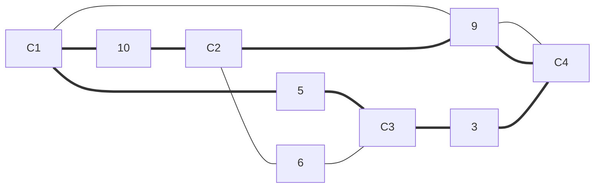

# 算法课程主要内容及有关概念

## 算法基础知识

### 算法研究内容

- 计算复杂性理论：货郎问题，背包问题，双机调度问题
- 问题复杂度概念：排序问题
- 算法设计与分析：调度问题，投资问题
- 算法的伪码表示
- 几类重要函数的性质
- 有关函数渐近的界的定理
- 时间复杂度函数的表示：函数渐近的界
- 算法及其时间复杂度的定义

### 货郎问题与计算复杂性理论

#### 货郎问题

问题描述：有n 个城市，已知任两个城市之间的距离。求一条每个城市恰好经过一次的回路使总长度最小。



至今没有找到有效的算法

#### 0-1背包问题

问题描述：
有n件物品要装入背包，第i件物品的重量$w_i$价值$v_i$，i=1,2,……,n,背包最多允许装入的重量为B，问如何选择装入背包的物品，使得总价值最大？

问题解的建模：
0-1向量 $<x_1,x_2,...,x_n>$
$x_i=1\Longleftrightarrow 物品i装入背包$
目标函数：$max=\sum_{i=1}^nV_iX_i$
约束条件：$\sum_{i=1}^nW_iX_i \leq B$
$x_i=0,1...,i=1,2,...,n$

#### 双机调度问题

问题描述：
有n项任务，任务i的加工时间为$t_i,t_i\in Z^+，i=1,2,...,n。用两台相同的机器加工，从0时刻开始计时，完成时间是后停止加工机器的停机时间。问如何把这些任务分配的两台机器上，使得完成时间最小

例：任务集：S={1,2,3,4,5,6}
$t_1=3,t_2=10,t_3=6,t_4=2,t_5=1,t_6=7$

解：
Machine 1 的任务：1，2，4
Machine 2 的任务：3，5，7

完成时间：max{3+10+2,6+1+7}=15

双机调度建模

解：
0-1向量 $<x_1,x_2,...,x_n>,x_i=1表示任务i分配到第一台机器$

不妨设机器1的加工时间$\le$机器2的加工时间
令$T=t_1+t_2+...+t_n,D=\lfloor T/2 \rfloor$,机器1的加工时间不超过D，且达到最大

#### NP难问题

- 这样的问题有数千个，大量存在于各个应用领域
- 至今没有找到有效算法（多项式时间内处理）：现有的算法的运行时间是输入规模的指数或更高阶函数
- 至今没有人能够证明对于这类问题不存在多项式时间的算法
- 从是否存在多项式时间算法的角度看，这些问题彼此是等价的。这些问题的难度处于可有效计算的边界

#### 算法+数据结构=程序；Alogrithm + Data Structure = Programming

好的算法

- 提高求解问题的效率
- 节省存储空间

算法的研究目标

- 问题$\longrightarrow$建模并寻找算法
- 算法$\longrightarrow$算法的评价
- 算法类$\longrightarrow$问题复杂度估计
- 问题类$\longrightarrow$能够求解的边界

### 算法机器时间复杂度

#### 算法

- 有限条指令的序列
- 这个指令序列确定了解决某个问题的一系列运算或操作

#### 算法A解问题P

把问题P的任何实例作为算法A的输入
每一步计算是确定性的
A能够在有限步停机
输出该实例的正确的解

#### 基本运算与输入规模

- 算法时间复杂度：针对指定**基本运算**，计数算法所做运算次数
- 基本运算：比较，加法，乘法，置指针，交换
- 输入规模：输入串的编码长度
  通常用下述参数度量：数组元素，调度问题的任务个数，图的顶点数与边数
- 算法的基本运算次数可表为输入规模的函数
- 给定问题和基本运算就决定了一个算法类

#### 算法的两种时间复杂度

对于相同输入规模的不同实例，算法的基本运算次数也不一样，可定义两种时间复杂度

- 最坏情况下的时间复杂度W(n)
  算法求解输入规模为n的实例所需要的最长时间

- 平均情况下的时间复杂度A(n)
  在给定同样规模为n的输入实例的概率分布下，算法求解这些实例所需要的平均时间
  A(n)计算公式
  设S是规模为n的实例集，实例$I\in S$的概率是$P_I$，算法对实例I执行的基本运算次数是$t_I$
  $$
  \notag A(n)=\sum_{I\in S}P_It_I
  $$
  在某些情况下可以假定每个输入实例的概率相等

  

### 函数的渐近的界

#### $大O符号$（严格上界）

$定义：设f和g是定义域为自然数集N上的函数。若存在正数c和n_0，使得对一切n \geq n_0有$
$$
\notag 0 \le f(n) \le c·g(n)
$$


成立，则称$f(n)$的渐近上届是$g(n)$记作
$$
\notag f(n)=O(g(n))
$$

1. $f(n)=O(g(n)),f(n)的阶不高于g(n)的阶$
2. 可能存在多个正数c，只需要指出一个即可
3. 对前面有限个值可以不满足哦不等式
4. 常函数可以写作O(1)

#### $大\Omega符号$（严格下界）

$定义：设f和g是定义域为自然数集N上的函数。若存在正数c和n_0，使得对一切n \geq n_0有$
$$
\notag 0 \le c·g(n) \le f(n)
$$
成立，则称f(n)的渐近的下界是g(n)，记作
$$
\notag f(n)=\Omega(g(n))
$$

1. $f(n)=\Omega(g(n)),f(n)的阶不低于g(n)的阶$
2. 可能存在多个正数c，指出一个即可
3. 对前面有限个n值可以不满足上述不等式

#### $小o符号$（上界）

$定义：设f和g是定义域为自然数集N上的函数。若存在正数c和n_0，使得对一切n \geq n_0有$
$$
\notag 0 \le f(n) \lt c·g(n)
$$
成立，则记作
$$
\notag f(n)=o(g(n))
$$

#### $小\omega符号$（下界）

$定义：设f和g是定义域为自然数集N上的函数。若存在正数c和n_0，使得对一切n \geq n_0有$
$$
\notag 0 \le cg(n) \lt f(n)\\
$$
成立，则记作

$$
\notag
f(n)=\omega(g(n))
$$


1. $f(n)=\omega(g(n)),f(n)的阶高于g(n)的阶$
2. 对不同的正数c，$n_0$不等，c越大$n_0$越大
3. 对前面有限个n值可以不满足不等式

#### $\Theta符号$(同阶)

$若f(n) = O(g(n))且f(n)=\Omega(g(n))则记作f(n)=\Theta(g(n))$

例:$f(n)=n^2+n,g(n)=100n^2,那么有f(n)=\Theta(g(n))$


#### 例$f(n)=n^2+n$

$f(n)=O(n^2),取c=2,n_0=1$

$f(n)=O(n^3),取c=1,n_0=2$

$f(n)=o(n^3),\\c \ge 1显然成立，因为n^2+n \lt cn^3(n_0=2)\\ 任给1\gt c\gt 0,取n_0 \gt \lceil2/c\rceil即可。因为\\ cn\ge cn_0\gt 2 (当n\ge n_0) \\ n^2+ \lt 2n^2\lt cn^3$

$f(n)=\omega(n),不能写f(n)=\omega(n^2),\\因为c=2时，不存在c_0使得一切n\ge n_0有 cn^2 = 2n^2 \lt n^2+n$


#### 有关函数渐近的界的定理

##### 定理1

定理：设f和g是定义域为自然数集和的函数

(1)$若  \mathop{lim}\limits_{n\rightarrow\infty} f(n)/g(n)存在，并且等于某个常熟c>0,那么f(n)=\Theta(g(n))$

(2)$若\mathop{lim}\limits_{n \rightarrow \infty}f(n)/g(n) = 0,那么f(n)=o(g(n))$

(3)$若 \mathop{lim}\limits_{n \rightarrow \infty} f(n)/g(n)=+ \infty,那么f(n)=\omega(g(n))$

##### 一些重要结果

(1)多项式函数的阶低于指数函数的阶,$n^d=o(r^n),r>1,d>0$

(2)对数函数的阶低于幂函数的阶,$ln \, n =o(n^d),d>0$


##### 定理2

定理：函数的阶之间的关系具有传递性


##### 定理3

定理：设函数f和g的定义域为自然数集，若对某个其他函数h，有f=O(h)和g=O(h),那么f+g=O(h).

##### 小结

- 估计函数的阶的方法：
  计算极限
  阶具有传递性
- 对数函数的阶低于幂函数的阶，多项式函数的阶低于指数函数的阶

##### 常见函数的阶

指数级：$2^n,3^n,n!,...$

多项式级：$n,n^2,nlogn,n^{1/2},...$

对数多项式级：$logn,log^2n,loglogn,...$


### 序列求和、递推方程、差消、递归树、主定理

##### 序列求和的方法

数列求和公式

$\sum\limits^n\limits_{k=1}a_k=\frac{n(a_1+a_n)}{2}$

$\sum\limits^n\limits_{k=0}aq^k=\frac{a(1-q^{n+1})}{1-q}$$\sum\limits^n\limits_{k=1}aq^k=\frac{a}{1-q}(q<1)$

$\sum\limits^n\limits_{k=1}\frac{1}{k}=ln \,n+O(1)$


#### 递推方程与算法分析

$设序列a_0,a_1,...,a_n,...,简记为\{a_n\},\\一个把a_n与某些个a_i(i<n)联系起来的等式叫做关于序列\{a_n\}的递推方程$

递推方程的求解：给定关于序列{$a_n$}的递推方程和若干初值，计算$a_n$


#### 递归算法

hanoi塔

```
if n=1 then move(A,C) // 1 plate from A to C
else Hanoi(A, B, n-1)
		 move(A, C)
		 Hanoi(B, C, n-1)
```

设n个盘子的移动次数为T(n)
T(n)=2T(n-1)+1
T(1)=1

#### 迭代法求解递推方程

##### 迭代法

- 不断用递推方程的右部替换左部
- 每次替换，随着n的降低在和式中多出一项
- 直到出现初值停止迭代
- 将初值代入并对和式求和
- 可用数学归纳法证明

##### **递归树**

- 递归树是迭代计算的模型
- 递归树的生成过程和迭代过程一致
- 递归树上所有项恰好是迭代之后产生和式中的项
- **对递归树上的项求和就是迭代后方程的解**最右边一列的和


$$
\notag 
T(n)=2T(n/2)+n-1,n=2^k\\
T(1)=0\\
T(n)=n-1 +n-2 +...+n-2^{k-1}\\=kn-(2^k-1)\\=nlogn-n+1\\=O(nlogn)\\
实际上求解过程就是设层数有k层,找到递推式令为1之后解出k
$$


$$
\notag
以第三张图递推方程为例计算求和O(n)\\
方程T(n)=T(n/3)+T(2n/3)+n\\
递归树层数为k,每层O(n)\\
n(2/3)^k = 1 \quad 取递归树最慢的分支每层n递归k次\\ \Rightarrow n = (3/2)^k \quad移项\\ \Rightarrow k = O(log_{3/2}n)\quad 常数同阶变换 \\ \Rightarrow T(n)=O(nlogn)
$$

####  **主定理/主方法**

##### 主定理的应用背景


$$
\notag
求解递推方程,设a\ge1,b\ge 1为常数,f(n)为函数,T(n)为非负整数\\
T(n)=aT(n/b)+f(n)\\
a:规约后的子问题个数\\
n/b:规约后子问题的规模\\
f(n):规约过程及组合子问题的解的工作量\\
例:\\二分检索:T(n)=T(n/2)+1\\
二分归并排序:T(n)=2T(n/2)+n-1
$$


##### 主定理的另外一种形式

如果较大的问题被分解成同样大小的几部分,那么分析相应算法的执行时间,往往可得到如下的递推关系式:
$$
\notag
T(n)=aT(n/b)+cn^k,T(1)=c\\a,b,c,k均为常数
$$

$$
\notag
以上递推式有如下性质
若k\neq 0时,则有:\\
T(n)=\begin{cases}
			\Theta(n^k), & a<b^k \\
			\Theta(n^klogn), & a= b^k\\
			\Theta(n^{log_ba}), & a>b^k
			\end{cases}\\
			若k=0时,f(n)=cn^k为常数,则有:\\
			T(n)=\begin{cases}
						O(n^{log_ba}  &a\neq1 \\
						O(logn) & a=1
			
			\end{cases}
$$

##### 主定理的应用


## 通用算法设计思想

### 分治法

一般原则:子问题均匀划分、递归处理

分治法能解决的问题一般具有以下特征:

- 问题的规模小到一定程度可以直接求解
- 问题可以分解为若干个相同的子问题
- 利用子问题的解可以组合成原问题的解
- 各子问题之间是相互独立的
- 问题的需要连续划分及平衡原则

#### 递归算法

由于分治法要求分解成同类子问题,并允许不断分解,使问题规模逐步减小,最终可用已知的方法求解足够小的问题,因此,分治法求解很自然导致一个递归算法.

##### 降低复杂度的途径

1.通过**代数变换**,减少子问题的个数


2.利用预处理减少递推操作


#### 求第k小元素问题

在n个元素的集合L中,选出某个元素值大小在集合中处于第k位的元素.

通常想法:排序后找第k小的数,时间复杂度为O(nlogn).

分治法:设原标长度为n,假定经过一趟划分,分成两个左右子表,其中左子表式中位元素及其左边元素的子表,设其长度为p,右子表是中位元素右边元素的子表.

- k=p,则中位元素就是第k小元素
- k<p,则第k小元素必定在左子表中,需求解的子问题成为在左子表中求第k小元素;
- k>p,必定在右子表中,需求解的子问题成为在右子表中求第k-p小元素.

```
首先，找出数组元素的中位数的中位数，然后利用Partition函数对整个数组进行划分，以数组中中位数的中位数为基准将数组划分为两部分——左边部分的所有数都小于基准，右边部分都大于基准，并返回基准数的下标值。
最后，如果要找到第k小个数,就将k的大小与数组左半边元素的个数（包括基准）进行比较，如果k小于j，则对左边部分进行递归，找第k小个数；若k大于j，则对右边部分进行递归，找第k-j个小数。
```


### 贪心法

贪心法:

- 分布决策:通过分步来求解问题
- 最优度量标准:贪心法每一步上用作**决策依据**的选择准则
- 可行解判定函数:根据最优度量标准选择分量的过程中,还需要使用一个可行解判定函数
- 贪心决策并不从整体上加以考虑的,它所做出的选择知识当前看似最佳的选择.

#### 最优化问题

- 约束条件:问题给定某些特定条件
- 可行解:满足这些约束条件的问题解称为可行解
- 目标函数:通常满足约束条件的解不是唯一的,为了衡量可行解的好坏,问题还给出了某个数值函数,称为目标函数.
- 最优解:使目标函数取最大(或最小)值的可行解称为最优解


#### 活动选择问题

问题:有n项活动申请使用同一个礼堂,每项活动又一个开始时间和一个截止时间,如果任何两个活动不能同时举行,问如何选择这些活动,从而使得被安排的活动数量达到最多.

选择的贪心策略:将完成时间按从小到大排序,按顺序从前向后挑选.同时要考虑到时间是否相容.


#### 0-1背包问题

问题描述:已知一个载重为M的背包和n件物品,每一件物品不能分割,第i件物品的重量为$w_i$,如果将第i件物品装入背包,将有收益$p_i$,$w_i>0,p_i>0$,i=1,2,3,...,n.求一种最佳装载方案,使得收益最大.

- 目标函数:$max\mathop\sum\limits^n\limits_{i=1}x_ip_i$
- 边界条件:$\mathop\sum\limits^n\limits_{i=1}w_ix_i\le M, x_i\in{0,1};i=1,2,...,n$
- 贪心策略:先装单位重量收益最高的,此种贪心策略下求得的背包问题的解是最优解


### 动态规划

动态规划通常用于求解具有某种最优性质的问题.

使用动态规划求解问题的必要条件

1. 优化原则/最优子结构特性:一个最优决策序列的任何子序列本身一定是相对于子序列的初始和结束状态的最优的决策序列
2. 重叠子问题

动态规划有自己的特点,动态规划可以解决子问题重叠问题,分治法的子问题相互独立,相同子问题被重复计算;且动态规划利用最优子结构,自底向上从子问题的最优解逐步构造出整个问题的最优解,即动态规划可以处理「不具备贪心准则」的问题.

动态规划的设计步骤:

1. 刻画最优解的结构特性
2. 递归定义最优解值
3. 以自底向上方式计算最优解值
4. 根据计算得到的信息构造一个最优解

第1和3步是动态规划算法的基本步骤.最优解值是最优解的目标函数.

#### 矩阵连乘问题

给定n个矩阵,且连续的矩阵之间是可乘的.由于矩阵乘法满足结合律,所以计算矩阵优多种不同的计算次序.问题:确定一种乘法次序,使得基本运算数乘的总次数最少.

最优计算次序的计算量等于$A_{1...k}和A_{k+1...n}$两者的最优计算次序的计算量之和,再加上$A_{1...k}和A_{k+1...n}$相乘的计算量.


可以用递归实现,若用递归实现会因为子问题多次重复计算而带来高时间复杂度问题.可以进而转为迭代实现,使用备忘录方法迭代实现.

#### 迭代实现——备忘录方法

- 每个子问题只计算一次
- 迭代过程:
  - 从最小的子问题算起
  - 考虑计算顺序,以保证后面用到的值前面已经计算好
  - 存储结构保存计算结果——备忘录
- 解的追踪
  - 设计标记函数标记每步的决策
  - 考虑根据标记函数追踪解的算法

动态规划的一种,为避免相同子问题的重复求解,为每个已经计算的子问题建立备忘录,即保存子问题的计算结果以备需要时引用.


子问题计算顺序,r=2时有12,23,34,45,56,67,78


3行即计算左边界i,4行为右边界j


s矩阵存储的值是在哪个位置画上括号,s[1,5]=3就是在$A_3$后画上括号,在看123矩阵连乘,s[1,3]=1就是在$A_1$后画上括号.


#### 投资问题

问题描述:m元钱,n项投资,$f_i(x)$:将x元投入第i个项目的效益.求使得总效益最大的投资方案.

建模:问题的解是向量
$$
\notag
<x_1,x_2,...,x_n>x_i是投给项目i的钱数,i=1,2,...,n.\\目标函数max{f_1(x_1)+f_2(x_2)+...+f_n(x_n)}\\约束条件x_1+x_2+...+x_n=m,x_i\in N
$$


子问题界定和计算顺序:
			子问题界定:由参数k和x界定
			k:考虑对项目1,2,...,k的投资
			x:投资总钱数不超过x

原始输入:k=n,x=m
			子问题计算顺序:
			k=1,2,...,n
			对于给定的k,x=1,2,...,m

优化函数的递推方程:$F_k(x):x元钱投给前k个项目最大效益$

多步判断:若知道p元钱($p\le x$)投给前k-1个项目的最大效益$F_{k-1}(p)$,确定x元钱投给前k个项目的方案.

递推方程和边界条件

$F_k(x)=\mathop{max}\limits_{0\le x_k\le x}\{f_k(x_k)+F_{k-1}(x-x_k\},k>1\\F_1(x)=f_1(x)$


$x_4(x)$的含义是第四个项目用了多少钱,篮筐中含义即最大效益为61,第四个项目用了1元,总共5元,还剩4元,追踪$x_3(4)=3$,即第三个项目用了3元,还剩1元,追踪$x_2(1)\rightarrow x_1(1)$


#### 最长公共子序列(LCS)


斜向上的箭头是x和y最后一个元素相同,向左的是y的最后一个元素不考虑,向上是x最后一个元素不考虑


从后向前输出子序列x[i]


横移和上移知识移动,斜向上移动才取字符

算法时间复杂度:$\Theta(mn)$,空间复杂度$\Theta(mn)$

#### 背包问题


#### 图像压缩

黑白图像存储

像素点灰度值:0-255,为8位二进制数

图像的灰度值序列:{$p_1,p_2,...,p_n$},$p_i$为第i个像素点灰度值

图像存储:每个像素的灰度值占8位,总计空间位8n

图像变位压缩的概念:将${p_1,p_2,...,p_n}$分成m段$S_1,S_2,...,S_m$

同一段的像素占用位数相同,第t段有l[t]个像素,每个占用b[t]位,段头:记录l[t]和b[t]需要11位,总位数为:$b[1]·l[1]+...+b[m]l[m]+11m$


### 回溯法

问题特征

- 解可以表示为一个n-元组($x_1,x_2,...,x_n$)
- 状态空间树:以树形结构表示的解空间
- 一个解对应于树中的一个叶子结点
- 问题求解方法:遍历搜索状态空间树

搜索策略:

- 为避免遗漏,在状态空间树上的搜索过程中,需遵照某种搜索策略
  - 回溯法使用**深度优先搜索**(DFS)寻找满足约束条件的所有可行解
  - 分支限界搜索使用广度优先搜索BFS策略,寻找满足约束条件的一个解,活在满足约束条件的可行解中寻找最优解
- 单纯使用这两种策略进行搜索的方法属于蛮力算法或穷举法

#### 剪枝函数 Pruning Function

回溯法和分支限界法在搜索过程中,使用剪枝函数剪去不必要搜索的子树,减少问题求解所需要实际生成的状态结点数,进行跳跃式搜索

分类:

- 约束函数:剪去不可能包含答案结点的子树
- 限界函数:对于组合优化问题,剪去不可能包含最有答案结点的子树


#### n-皇后问题

n-皇后问题要求在一个nxn的棋盘上放置n个皇后,使得它们彼此不受“攻击”.n-皇后问题要求寻找在棋盘上放置着n个皇后的方案,使得它们中任何两个都不在同一行、同一列或同一斜线上


#### 图的着色问题


### 分支限界(极大化)

- 设立限界函数(极大化)
  - 函数值时以该结点为根的搜索树中的所有可行解的目标函数的上届
  - 父结点的代价$\ge$子结点的代价
- 设立界
  - 代表当时已经得到的可行解的目标函数的最大值
  - 初值=0
  - 可行解的目标函数大于当时的界,进行更新
- 搜索汇总停止分支的依据
  - 不满足约束条件
  - 其限界函数小于当前的界值

#### 货郎问题(TSP)

问题描述:给定n个城市集合C={$c_1,c_2,...,c_n$}从一个城市到另外一个城市的距离$d_{ij}$为正整数,求一条最短且每个城市恰好经过一次的巡回路线.


限界函数的设计:
$$
\notag
L = \mathop\sum\limits^k\limits_{i=1}C[r_{i-1}][r_i]+l_{r_k}+\mathop\sum\limits_{r_i\notin B}l_{r_i}
$$
上式中$\mathop\sum\limits^k\limits_{i=1}C[r_{i-1}][r_i]$表示已经走过的距离,$l_{r_k}$表示现在所在点出发的最短距离,$\mathop\sum\limits_{r_i\notin B}l_{r_i}$表示除了已经到达过城市之外的城市所出发的最短距离之和.

#### 圆排列问题

问题描述:给定n个圆的半径序列$R={r_1,r_2,...,r_n}$,将它们放到矩形框中,各圆与矩形底边相切,求具有最小排列长度$l_n$的圆排列


## 线性规划问题

规划问题:

生产和经营管理中经常提出如何合理安排,使人力、物力等各种资源得到充分利用,获得最大的效益,就是规划问题

线性规划:

- 对满足有限个现行的等式或不等式约束条件的决策变量的一个线性目标函数求其最大值或者最小值的最优化问题
- 通常解决下列两类问题
  - 当任务或目标确定后,如何统筹兼顾,合理安排,用最少的资源去完成确定的任务后目标(运筹学)
  - 企业在一定的资源条件下,如何组织安排生产获得最好的经济效益

#### 生产计划问题

问题描述某企业在计划期内生产甲、乙两种产品.按工艺资料规定,每件产品甲需要消耗材料A2公斤,消耗材料B1公斤,每件产品乙需要消耗材料A1公斤,消耗材料B1.5公斤.已知在计划期内可供材料分别为40公斤、30公斤;每生产一件甲、乙两产品,企业可获得利润分别为300、400元,如图所示.假定市场需求无限制.企业决策者应如何安排生产计划,使企业在计划期内总的利润收入最大.


#### 二维线性模型的图解法

线性规划问题的求解方法一般有两种:

- 图解法
  - 两个变量、直角坐标
  - 三个变量、立体坐标
- 单纯形法
  - 适用于任意变量、但必须将一般形式变成标准形式

图解法步骤

- 求可行解几何
  - 分别求出满足每个约束包括变量非负要求的区域,其交集就是可行解几何,或称为可行域
- 绘制目标函数图形
  - 先过原点作一条矢量指向点($c_1,c_2$),矢量的方向就是目标函数增加的方向,或称为梯度方向
  - 再作一条与矢量垂直的直线,这条直线就是目标函数图形
- 求最优解
  - 依据目标函数求最大或最小移动目标函数直线,直线与可行域相交的点对应的坐标就是最优解.求最大值时直线沿着矢量方向移动,求最小值时沿着矢量的反方向移动.

线性规划的解有四种形式:

1. 唯一最优解:一定对应于可行域内的顶点
2. 无穷多最优解:多重解,平行于边界线
3. 无界解:无最优解的情况,原因是缺少必要的约束条件
4. 无可行解:可行域为空集,出现相互矛盾的约束条件.


#### 标准形

基本概念:

- 在用单纯形法求解线性规划问题时,为了讨论问题方便,需将线性规划模型化为统一的标准形式.
- 线性规划问题的标准型为:
  1. 目标函数求max or min
  2. 约束条件都为等式方程
  3. 变量$x_j$非负
  4. 常数$b_i$非负

如何化为标准形式

- 目标函数的转换
  - 如果是求极小值,即$min\,z=\sum c_jx_j$,则可将目标函数乘以(-1),可化为求极大值问题,即:$max\,z'=-z=-\sum c_jx_j$
- 变量的变换
  - 若存在取值无约束的变量$x_j$,可令$x_j=x_j'-x_j'',其中x_j=x_j',x_j''\ge0$
- 约束方程的转换:由不等式转换为等式
  - $\sum a_{ij}x_j \le b_i$转换为$\sum a_{ij}x_j+x_{n+i}=b_i,x_{n+i}\ge 0(松弛变量)$
  - $\sum a_{ij}x_j \ge b_i$转换为$\sum a_{ij}x_j-x_{n+i}=b_i,x_{n+i}\ge 0(剩余变量)$
- 变量$x_j \le 0$的变换
  - 可令$x_j'=-x_j,x_j' \ge 0$

例题:将下列线性规划化为标准型
$$
\notag
min\,Z=-x_1+x_2-3x_3\\
\begin{cases}
2x_1+x_2+x_3 \le 8  \qquad\quad(1)\\
x_1+x_2+x_3 \ge 3 \qquad\quad\,\,\, (2)\\
-3x_1+x_2+2x_3 \le -5 \quad(3)\\
x_1\ge 0, x_2\ge 0, x_3无符号要求
\end{cases}
$$
(1)$x_3$无符号要求,即$x_3$取正值也可取负值,标准型中要求变量非负,所以令$x_3=x_3'-x_3'', 其中x_3',x_3''\ge 0$;

(2)第一个约束条件是$\le$号,在$\le$左端加入$x_4\ge 0$,化为等式;

(3)第二个约束条件是$\ge$号,在$\ge$号左端减去$x_5\ge 0$

(4)第三个约束条件是$\le$且常数项为负数,因此在$\le$左边加入$x_6\ge 0$,同时两边乘-1

(5)目标函数是最小值,为了化为求最大值,令$Z'=-Z,得到max\, Z'=-Z$,即当Z达到最小值时Z'达到最大值,反之亦然.

综合下来得到标准型
$$
\notag
max\,Z'=x_1-x_2+3x_3'-3x_3''
\\
\begin{cases}
2x_1+x_2+x_3'-x_3''+x_4 = 8\\
x_1-x_2+x_3'-x_3''-x_5=3\\
3x_1-x_2-2(x_3'-x_3'')-x_6=5\\
x_1,x_2,x_3',x_3'',x_4,x_5,x_6\ge 0
\end{cases}
$$
当某个变量$x_j\le 0$时,令$x_j'=-x_j$.当某个约束时绝对值不等式时,将绝对值不等式化为两个不等式,再化为等式,例如约束$|4x_1-x_2+7x_3\le 9|$,将其化为两个不等式.再加入松弛变量化为等式.
$$
\notag
\begin{cases}
4x_1-x_2+7x_3 \le 9\\
-4x_1+x_2-7x_3 \le 9
\end{cases}
$$


##### 标准形的可行解的性质

定理:对于标准形,方程Ax=b的一个解$\alpha$是基本解$\Leftrightarrow$x中的非零分量对应的列向量线性无关

定理:如果标准形有可行解,则必有基本可行解

定理:如果标准形有最优解,则一定存在一个基本可行解是最优解


#### 单纯形法

##### 基矩阵/基Basic Matrix

- 设LP模型的标准形是
  $$
  \notag
  max\,Z=CX
  \\
  \begin{cases}
  AX=b\\
  X \ge 0
  \end{cases}
  $$
  ​	式中A是约束条件的$m\times n$阶系数矩阵,其中,$m\le n$且r(A)=m

- A中至少有一个m阶满秩子矩阵B,使得r(B)=m

- B是LP的一个基/基矩阵

  - 当m=n时,基矩阵唯一
  - 当m<n时,基矩阵就可能有多个,但数目不超过$C^m_n$

- 由线代知识可知,基矩阵B必为可逆矩阵且$|B|\neq 0$


#### 可行解

满足线性规划模型约束条件的解

#### 最优解

满足线性规划模型目标函数的可行解

#### 基本解Basis Solution

对某一确定的基B,令**非基变量**等于0,利用AX=b解出基变量,则这组解称为基B的基本解.


#### 基本可行解

若基本解满足$x\ge 0$的非负约束,称为基本可行解.

#### 单纯形法具体步骤

求解思路:先求出一个初始基本可行解,并判断其是否最优,若不是最优,再换一个基本可行解并判断,直到得出最优解/无最优解

求解步骤:

1. 化标准型,求初始基本可行解,建立初始单纯形表
2. 求检验数并判断,若已得到最优解,结束计算;否则转入下一步
3. 基变量,构建新的单纯形表进行迭代
4. 重复步骤2,3,直到得出最优解/无最优解


判断检验数的规则(**目标函数求max,且无人工变量的情况**)

(1)所有检验数都满足$\sigma_j\le 0$,得到最优解.

- 若所有非基变量的检验数均小于0,则为唯一最优解
- 若存在非基变量的检验数为零,则为多重解

(2)若存在检验数$\sigma_k \gt 0$,且其对应的变量$x_k$的系数列向量$P_k\le 0$,则为无界解


#### 大M单纯形法(添加人工变量的线性规划问题)


##### 人工变量

构造人工变量的情况:若系数矩阵中不存在单位矩阵,则加入非负的人工变量,狗仔一个单位矩阵

最优解分析:若线性规划由最优解,则人工变量必定为0

求解思路:为使人工变量为零,就要使人工变量从基变量中  出基 变为非基变量

##### 大M单纯形法步骤


判断检验数(目标函数求max,含有人工变量的情况):

(1)所有检验数都满足$\sigma_j\le 0$,**且基变量中无人工变量**,得到最优解

- 若所有非基变量的检验数均小于零,则为唯一最优解
- 若存在非基变量的检验数为零,则为多重解

(2)**所有检验数都满足$\sigma_j\le 0$,但基变量中含有非零的人工变量,则无可行解**

(3)所有检验数都满足$\sigma_k\gt 0$,且其对应的变量$x_k$的系数列向量$P_k\le 0$,则为无界解


为减少计算量,出基变量列可以不用计算,即第二段及下面段中的$x_7$和第三段的及下面的$x_6$

#### 二阶段单纯形法

第一阶段:

决策变量:原来问题未知变量+松弛变量+人工变量

目标函数:人工变量之和求最小值

约束条件:原问题加入人工变量后的约束条件

PS:若得到最优目标函数值为零,说明原问题有基可行解,可以进行第二阶段计算;反之说明原问题无可行解,停止计算

第二阶段:

决策变量:原问题未知变量+松弛变量

目标函数:原问题目标函数

约束条件:将第一阶段计算得到的最终表,去除人工变量列


## 网络流问题

### 最大流问题

#### 网络流及其性质

- 容量网络N=<V,E,c,s,t>
  - 简单有向图
  - V:顶点集
  - E:弧集
  - s:源点(Source)
  - t:汇点(Sink)
  - c(u,v)$\ge$0:$对\forall<u,v>\in E,<u,v>上的容量,如果c<u,v>=0,则<u,v>不存在于网络中$
- <u,v>上的流量f(u,v)
  - f:容量网络N上的可行流f
  - $0 \le f(u,v)\le c(u,v)$
  - <u,v>的类型
    - 饱和边:f(u,v)=c(u,v)
    - 非饱和边:f(u,v)<c(u,v)
    - 零流边:f(u,v)=0
    - 非零流边:f(u,v)>0


- **括号内左边的数字表示这条管道的当前流量f**
- **右边的数字表示管道的容量c**

#### 网络流f的三个性质

1. 容量限制
2. 斜对称性
3. 流量守恒

1.容量限制

对$\forall <u,v> \in E$,有:

$0 \le f(u,v) \le c(u,v)$

2.斜对称性

$对\forall<u,v> \in E,有:\\ f(u,v)= -f(u,v)$

3.流量守恒

$对\forall x \in V-\{s,t\},流入结点x的流量之和=流出结点x的流量之和,即\\ \mathop\sum\limits_{v:<v,x>\in E}f(v,x)=\mathop\sum\limits_{u:<x,u>\in E}f(x,u)$

结合斜对称性,流量守恒也可以写成:

$\mathop\sum\limits_{u\in V}f(v,u)=0$

#### |f|:网络流量

一个合法的网络流量|f|等于从源点s点流出的流量,也等于流向汇点t的流量,即:

$|f|=\mathop\sum\limits_{v:<s,v>\in E}f(s,v)=\mathop\sum\limits_{v:<v,t>\in E }f(v,t)$

#### 残量网络N(f)Residual Graph

容量网络N=<V,E,c,s,t>,f时N上的可行流.定义N关于f的残量网络N(f)=<V,E(f),r,s,t>如下:

- E(f)=$E^+(f)\cup E^-(f)$
  - 前向弧集$E^+(f):这些弧在N中是非饱和的$
    $E^+(f)=\{<i.j>|<i,j>\in E 且f(i,j)<c(i,j)\}$
  - 后向弧集$E^-(f):这些弧的反向弧在N中是非零流的$
    $E^-(f)=\{<i.j>|<i,j>\in E 且f(i,j)>c(i,j)\}$
- 残量:r(i,j)>0

$r(i,j)=\begin{cases}c(i,j)-f(i,j), \quad <i,j>\in E^+(f)\\f(j,i),\qquad \qquad \quad <i,j>\in E^-(f) \end{cases}$

- N(f)也是容量网络,没有平行边


从右侧残量网络中可以清楚地看到:

- $r(s,v_2)=3$,从s到$v_2$还可以再增加3单位的流量
- $r(v_1,t)=2$,从$v_1$到t还可以再增加2单位的流量

##### 后向弧

- $(v_1,s)$是后向弧
- $r(v_1,s)=4$表示从$v_1$到s还可以增加4单位的流量
- 也即流进来的流量可以流回去,没流进来的弧上剩余的流量可以流进来.

为什么要建立后向弧?

- 路径$s\rightarrow v_2\rightarrow v_1\rightarrow t$经过的弧的流量都增加2,就得到了该网络的最大流.
  - 这条路径经过了一条后向弧:$<v_2,v_1>$
  - 如果不设立后向弧,算法就不能发现这条路径
- 本质上,后向弧为算法纠正自己所犯的错误提供了可能性
  - 它允许算法取消先前的错误行为(让2单位的流从$v_1$到$v_2$)
- 当然,可以把上面说的情况当成特殊情况来处理.使用后向弧可以使编程简单许多
- 后向弧只是概念上的,在程序中后向弧与前向弧并无区别

##### 点集间的流量和、容量和残量网络容量和

- 将f,c,r的定义域扩展为点集
  - 在之后的叙述中,大写字母X,Y,S,T一般均表示点集
- 点集间的流量和:X中的任意一点与Y中的任意一点组成的所有边上的流量之和(边的方向为从X中的结点到Y中的结点),即:$f(X,Y)=\mathop\sum\limits_{x\in X}\mathop\sum\limits_{y\in Y}f(x,y)$
- 类似的,有点集间的容量和c(X,Y)、点集间的残量网络容量和r(X,Y)的定义

##### 点集总流量=0

定理:不包含s,t的点集X,与它关联的边上的流量和为零
$$
\notag
f(X,Y)=\mathop\sum\limits_{x\in X}\{\mathop\sum\limits_{v \in V}f(x,v)\}=\mathop\sum\limits_{x\in X}0=0
$$
相关结论:

1.由流量的斜对称性,有:

- f(X,X)=0
- f(X,Y)=-f(Y,X)

2.$f(X \cup Y,Z)=f(X,Z)+f(Y,Z)$

3.$f(X,Y \cup Z)=f(X,Y)+f(X,Z)$

#### 网络中的割集

容量网络$N=<V,E,c,s,t>$的割集(S,T)由两个**点集**S和T组成,定义如下:
$$
\notag
(S,T)=\{<i,j>|<i,j>\in E \and i \in S \and j\in T\}
$$
其中

1.$S\cup T =V$

2.$S\cap T = \oslash$

3.$s \in S$

4.$t \in T$

##### 最小割集

重要概念:割(Cut):

定义:有向图G(V,E)的s-t割
$$
\notag
\begin{aligned}
&两个集合S,T满足\\
&·S\cup T = V,S \cap T =\oslash\\
&·s\in S,t\in T\\
&·割的大小:|\{(u,v)\in E | u\in S,v\in T\}|\\
&按照S \rightarrow T的方向穿过的割的边数
\\
&也即起点s在S中,终点t在T中的两个点集构成割
\end{aligned}
$$


割的大小:S={S,B,D},T={A,C,T},根据割的定义是S到T方向穿过的割的个数,也就是边数可以得出

$s \rightarrow a,b\rightarrow c, d\rightarrow c$,割的大小是3.


- 割集(S,T)的流量f(S,T)

- 割集(S,T)的容量c(S,T):

  $c(S,T)= \mathop\sum\limits_{<i,j>\in (S,T)}c(i,j)$

- **最小割集**:使c(S,T)最小的割集

- 定理:任何**可行流的流量**不超过**任意割的容量**,因此,**最小割集的容量=最大流**

- **任意割集的流量=整个网络的流量**


#### 最大流最小割定理

定理:最大流的流量=最小割集的容量

定理:在同一个时刻,网络流中以下三个条件等价

1. f是网络的最大流
2. 残量网络中无可增广路径
3. 存在某个割集(S,T),使得f=c(S,T)

#### 增广路径法FF-Ford-Fulkerson算法


画图步骤:

1. 画出原始网络和残量网络,原始网络中的权重指的是容量,残量网络中的权重指的是残量,最后**流量=容量-残量,即Flow=Compacity-Residual**
2. 在残量中图中寻找源点到终点的路径,找到这条路径上的最小权重值,路径所有边上权重减去这个权重值,在添加反向弧,反向弧上的权重值为刚才减去的权重值.同起点终点的反向弧可以合并.权重为0的边不画
3. 重复步骤2,直到无法从源点到终点,此时去掉所有的反向弧,使用原网络图减掉残量网络图,得到的值是每条边上的流量.


#### Dinic算法

level graph

可用BFS得到level graph


- AN(f)是基于N(f)的
- AN(f)会多所有顶点标号(与s的距离)
- $\forall <i,j> \in AN(f),有d(j)=d(i)+1$,即$AE(f)=\{<i,j>|<i,j>\in E(f),d(j)=d(i)+1\}$


##### 极大流

定义:N(f)中不含后向弧的增光链称为前向增广链

定义:如果不存在关于f的$s\rightarrow t$前向增广链,则称f是N中的极大流

- 最大流一定是极大流
- 极大流不一定是最大流


算法步骤(构建残量图)

1. 初始化原流量图和残量图
2. 重复下列操作:
   - 构建残量图的level graph
   - 在level graph中找阻塞流
   - 利用找到阻塞流的level graph更新残量图,直至level graph不可达,也即残量图不可达
3. 最后去掉残量图中的反向弧,用原流量图减去残量图即得到最大流


### 最小费用流问题

- 最大流网络可看作货物的运输网络,
  - 仅表明运输网络运输货物的能力
  - 但没有考虑运送货物的费用
- 最小费用流要讨论的内容
  - 运送同样数量货物的运输方案可能有多个,从中找出一个输出费用最小的方案

容量-费用网络

在容量网络N=(V,E,c,s,t)中添加单位费用

$w:E\rightarrow R^* ,记作:N=(V,E,c,w,s,t)$

最小费用流问题

- 设f是N上的一个可行流,f 的费用定义为
  - $w(f)=\mathop\sum\limits_{<i,j>\in E}w(i,j)f(i,j)$
- 在所有流量为$v_0$的可行流中,费用最小的称作流量$v_0$的最小费用流
- 最小费用流问题:给定容量-费用流网络N和流量$v_0$,求流量$v_0$的最小费用流

##### 负回路

设赋权有向图D=<V,E,w>,其中权函数$w:E\rightarrow R$,D中权为负数的回路被称为负回路

定理:D中不含负回路当且仅当D中任意两点之间都有最短路径或不存在路径.

##### Floyd算法

求带负权的最短路径和检测负回路的算法

更新维护两个矩阵,第一个矩阵为邻解带权矩阵,第二矩阵为中转点矩阵.


$h_k[i][j]是根据d矩阵更新的,若d矩阵相应位置更新了,则h矩阵相应位置也需要更新$

##### 最小费用流的负回路算法

伴随网络流f的残量网络,按照一下规则构建一个新的残量网络.

1. 顶点,两顶点相同
2. 弧与权:
   1. 原图中的弧为零流弧的,残量网络中构建同向弧,c'=c-f,b=b
   2. 原图中的弧是饱和弧,残量网络中构建反向弧,c=f,b=-b
   3. 原图中的弧为非饱和弧,则同时构建同向弧和反向弧,同向弧上c'=c-f,b=b;反向弧上c'=f,b=-b
3. 负回路:在残量网络中,所有弧的权之和小于零的回路称为负回路
4. 增流圈:在残量网络汇总给你的负回路对应网络N中的一个圈,在这个权重,如果方向与负回路方向相同的所有弧都是非饱和弧,方向与负回路相反的所有弧都为非零流弧,则这个圈称为增流圈

设容量-费用网络N=(V,E,c,w,s,t),f是N上的一个可行流,将关于f 的残量网络N(f)推广到容量-费用网络,记作

$N(f)=<V,E(f),r,aw,s,t>$

其中:

$E(f)=E^+(f) \cup E^-(f)\\ r(i,j)=\begin{cases}c(i,j)-f(i,j),\quad &<i,j> \in E^+(f)\\ f(j,i) , \quad &<i,j>\in E^-(f)\end{cases} \\ aw(i,j)=\begin{cases}w(i,j), \quad &<i,j>\in E^+(F) \\ -w(j,i), \quad &<i,j>\in E^-(f)\end{cases}$

$aw$称作为残量费用

引理:设f是容量-费用网络N上的一个可行流,g是残量网络N(f)上的可行流,$f'=f+g$,则$w(f')=w(f)+aw(g)$.

##### 圈流$h^c$与环流量$\delta$

设c是容量-费用网络$N=(V,E,c,w,s,t)$中一条简单回路,E(C)是C的边集.C上圈流$h^c$定义如下:
$$
\nonumber
h^c(i,j)=\begin{cases}
\delta, &<i,j>\in E(C)
\\
0,&<i,j>\in E-E(C)\\

\end{cases}\\
其中\delta>0称作h^c的环流量
$$
$h^c$是一个可行流则

$v(h^c)=0 \\ w(h^c)=\delta \times w(C)\\ w(C) = \mathop\sum\limits_{<i,j>\in E(C)}w(i,j)$


1. 利用最大流算法,将网络的流量调整到最大流
2. 构建伴随网络流f的残量网络$D_f$
3. 在残量网络中,查找关于费用的负回路,令$\theta=min\,c_{ij}'$($c_{ij}'$为负回路中各弧的容量),若不存在负回路,则说明当前网络流已经是最小费用流,结束算法
4. 针对负回路对应网络D中的圈,若该圈是增流圈,则把增流圈方向上与负回路方向一致的所有弧的流量加上$\theta$,把增流圈方向上与负回路方向相反的所有弧的流量减去$\theta$;若该圈不是增流圈,则转到步骤三重新寻找负回路
5. 继续寻找负回路,如果还有负回路,继续调整;否则返回步骤二


解法二是利用最短路径算法调整流量,初始先令流量为0,然后寻找最短路径,调整流量.


## 随机算法

##### 米勒-拉宾算法改进素数测试过程

米勒拉宾算法改进素数测试过程,使用伪码描述.


##### 求a模n的m次幂问题


#### 串相等测试问题

A有一个长串x,B有长串y,A和B希望知道x=y?使用蒙特卡洛随机算法对该问题的求解进行改进.


分析该算法的优缺点:

